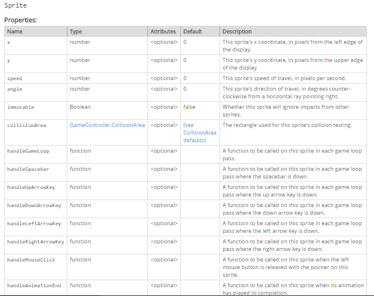

# 1. Stranger Hunt

## How to Use This Tutorial

Welcome to the first tutorial for the course! 

This document has two different kinds of content: general information and action steps.

General information appears in ordinary unlabeled text, like this sentence. This form of content will be used to introduce and explain new concepts.

Action steps are indicated with a checkbox.  Basically just do all the stuff with a box next to it.  

Complete the tutorial program, AND the assignment at the end of the tutorial in separate `js` files.  Your instructor will grade your work in its current state on the due date for each assignment.

## Access the virtual workspace

`repl.it` combines an online code editor with a workspace in the cloud.  It supports over 60 languages including JavaScript, which we will be using.   Accept the invitation in your `@dewv` email from your instructor or click on [this](https://repl.it/classroom/invite/ftKp6S7) link for a direct invitation.

In your repl dashboard, select the CSCI-110 Classroom, then select the first project "Stranger Hunt."  This will create your own personal repl that contains some files that will help you get started on the first tutorial.

Most of your time in this course will be spent writing some JavaScript code in the repl development environment, and viewing the output in a web browser. The beauty of it is you can give anyone in the world with an internet connection the address of the webpage created when you launch your application from repl and they can use your application (i.e. play your game) on any platform in any browser with no software required.[^1]

## Cast of Characters

Our tutorials will be populated with characters from the Computational Fairy Tales kingdom created by Jeremy Kubica at [http://computationaltales.blogspot.com](http://computationaltales.blogspot.com/). You are about to meet three of them.

Princess Ann is the central character of these tales. She is the daughter of King Fredrick and heir to the throne. She was tasked by the prophets to rescue the kingdom from the coming darkness. Unfortunately, the prophecy was vague about the details of the threat facing the kingdom. Thus, she is on a quest to determine what the threat is and how to stop it.

Marcus is a powerful wizard who is constantly looking for magical solutions to everyday problems. His approach to spells can teach you a lot about computational thinking and the art of computer programming.

The third character is a mysterious stranger in a dark cloak. Are his spells powerful enough to defeat Marcus? What does he have to do with the prophecy of coming darkness?

## Game Design: Stranger Hunt

You are about to build a simple game that will introduce you to the basics of running a JavaScript program from repl.it.

In this game, our three characters will move about inside a room enclosed by stone walls.

As the player, you will score points by casting a spell on the mysterious stranger. (You will cast a spell with a mouse click.)

Be careful! By accidentally casting the spell on Marcus, you will lose points.

Worse still, casting the spell on Princess Ann, who has no magical protection, will end the game.

## Creating a simple game (room with score) and running it in a browser window

First we will create a valid but do-nothing game, just a background and a score board.

- [ ] Open a web browser and go to https://repl.it
- [ ] Login and open your Stranger Hunt repl (this assumes you already enrolled in the class and linked the first project)

In the left margin you will notice a "Workspace" tab that contains a directory tree of files in the current project.  

You should see some .png files, an .html file, and a .js file.

- [ ] Double click the StrangerHunt.js file and you will see this in the editor window

```javascript
import {game} from "./sgc/sgc.js";
game.setBackground("floor.png");
game.showScore = true;
```

Some explanations are in order.  `game` is an object created in sgc that has several *properties* and *methods*.  These concepts are well illustrated with the `car` object in this [w3schools tutorial](https://www.w3schools.com/js/js_objects.asp).  Unless you are already familiar with JavaScript objects and how to define and access them, please look at the tutorial before continuing.  

- [ ] Read the w3schools tutorial about objects (https://www.w3schools.com/js/js_objects.asp)

All we are doing with these three lines is assigning values to a`game` *property*  (`showScore`) and calling a `game` *method* (`setBackground()`).  From now on I will refer to these properties and methods without the `game` *identifier* (the name of the object), but remember to always include it in your code!

- [ ] Select the `index.html` file and hit the green arrow to 'Run' it.   A result window will display the `floor.png` image and a score block.  The console window will show you any errors or warning from the interpreted code.  You can ignore the phaser warning about the background.

Congratulations!  First steps are the hardest; now you know how to enter Javascript code and make your application run in any browser window. 

Next we will add some walls to the room.

## Creating a Sprite

A sprite is a graphic image that can be drawn on the screen.  Later you will create these from scratch using some tools that come with Windows (Paint and Photo Editor), or one of several powerful and free image-editing programs such as GIMP and IrfanView, but for now we will just use the images already loaded in your StrangerHunt folder (`ann.png`, `floor.png`, `marcus.png` and `stranger.png`).

We also use the word `Sprite` to define a *class* of objects in `sgc.js`.  We will talk more about this in the next section.

We are going to have to put these sprites somewhere on the screen.  In order to do that we have to know something about the coordinate system we will be using.

### Coordinate system


In order to describe the position of an object in two dimensions with coordinate pairs (x,y), we first have to define an *origin*.  The choice is an arbitrary *convention*, but everyone has to agree.  In the case of any type of window including your browser window, the convention is to use the **upper left hand corner** as the origin.  That means we will be working in Quadrant IV in the above picture to describe the location of any object in the window.  All we care about is the *magnitude* of x and y, since we know we are always staying in quadrant IV, so for simplicity, we use positive numbers for both x and y (this is another convention). Our default room size is 800 x 600 (meaning x can vary from 0 to 800, and y can vary from 0 to 600).   Our default grid size is the height and width of our character sprites, which is 48.  These dimensions are all in 'number of *pixels*" and are stored in the `game` properties `displayWidth`, `displayHeight`, and `gridSize`.  

The *direction* is indicated with a counter-clockwise angle measurement from the positive x axis.  For example; straight up is 90 degrees, left is 180 degrees, down is 270 degrees and so on.

But what is a pixel?  

- [ ] Read [Pixels, Peacocks, and the Governor's Turtle Fountain](http://computationaltales.blogspot.com/2011/06/pixels-peacocks-and-governors-turtle.html) at [computationaltales.blogspot.com](http://computationaltales.blogspot.com/p/posts-by-topic.html).

## Classes and Objects

Please read [Marcus and the Cursed Cheese](http://computationaltales.blogspot.com/2011/08/data-validation-marcus-and-cheese.html), parts 1 - 3.

**In objected oriented programming, a class defines the type of an object. In particular, an object's class defines the data and methods for that object. Alternately, the individual objects in a program can be viewed as specific instances of a class.** (from [Part 3 of Marcus and the Cursed Cheese](http://computationaltales.blogspot.com/2011/09/classes-of-cheese-part-3-of-marcus-and.html)).

There is a lengthy explanation of how to use classes in Javascript [here](https://developer.mozilla.org/en-US/docs/Web/JavaScript/Reference/Classes), but I often find it easier to learn something by using it, so let's jump right in by looking at the class documentation for the `Sprite` class in `sgc.js`: https://csci110.github.io/sgc/

- [ ]  At the sgc home page you will see a table of contents for the API documentation.  Select the `Sprite` class from the list on the right-hand side. 

Notice the class definition has a list of properties and methods, which can be used by any instance of the class.  In particular, notice that there are some *properties* called `width`,` height`, `x`, `y`, and `accelerateOnBounce`; and a *method* called `setImage()`.  This keeps us from having to define these every time we want to make a new sprite that would use these properties and methods!  

Let's import this class definition into our strangerHunt.js file.

- [ ] Modify the first line of your code to add the `Sprite` class to the list of modules in the `import` directive like this:

```javascript
import {game, Sprite} from "./sgc/sgc.js";
```

## Creating an Object from a Class definition

Javascript uses an "object-oriented" programming style. This means that the programming is organized by defining the behavior of various objects within the game.

Let's declare and initialize an object called `topWall`, by creating an instance of the `Sprite` class like this:  

- [ ] Type this in your `strangerHunt.js` file, somewhere after your `import`  statement:

```javascript
let topWall = new Sprite();
topWall.width = 800;
topWall.height = 48;
topWall.setImage("horizontalWall.png");
topWall.x = 0;
topWall.y = 0;
topWall.accelerateOnBounce = false;
```

Here is a breakdown of this code snippet:

<u>Use `let` to declare a [local] variable</u>

`let` is the JavaScript keyword we should use to declare and initialize variables (there are other options but *let's* use `let` whenever we can).  `topWall` is an object with all the properties and methods of the `Sprite` class but we only set the values for those properties and methods that we actually want to use.  We assign values to each property with the  `=` operator (which means "gets" in the sense of "is assigned the value of").  

Notice how we capitalized  `topWall`?  The preferred object naming convention is to use lower case for the first word and to capitalize the second word.  There is even a term for this - camelCase.  Since we can't have spaces in variable names, it's the way JavaScript pushes words together and still keeps them legible (here is a [video](https://www.youtube.com/watch?v=NJhXiR1z7Kg) if you want more information).

<u>The `new` operator</u>

The new operator creates an instance of a class.  That is to say, it creates an object with all the properties and methods of the class.  The class is like a cookie cutter template.  Any individual cookie objects made with the cookie cutter are *instances* of the class.

<u>`width` and `height`</u>

How did we know what values to use for `width` and `height`?  In order to answer that we have to look at the image file that we are using to represent this sprite.  The fourth line in the code you just wrote says the associated image file is `horizontalWall.png`. 

- [ ] Select the `horizontalWall.png` file in your workspace directory and click on the link in the IDE window that says "Click here to download."  

Open the downloaded file with Paint 3D and select `Canvas`.  On the right panel you will see Width: 800px, Height:48px.  This is the width (W) and height (H) of the image in pixels (px).

<u>`accelerateOnBounce`</u>

The last property (`accelerateOnBounce`) is used by sgc's collision handler and we will see how that comes into play shortly.

<u>`x` and `y` positions</u>

The position of a sprite is determined by the sprite's origin, which (as you probably guessed) is the upper left corner of the sprite.  So the top wall was pretty easy; setting the (x, y) coordinates to (0, 0) places it in the upper left corner of the browser window.  The question is, what x and y values should we use for the other walls?

To position the left wall, we can use the height of the `topWall` sprite, which is stored in the property `topWall.height`, and put the origin of the `leftWall` sprite at the bottom of the `topWall` sprite like this:

```javascript
let leftWall = new Sprite();
leftWall.width = XX;
leftWall.height = XXX;
leftWall.setImage("verticalWall.png");
leftWall.x = 0;
leftWall.y = topWall.height;
leftWall.accelerateOnBounce = false;
```

- [ ] Replace the X's in the previous code snippet with the correct width and height values for the verticalWall.png image file.
- [ ] Using the previous steps as a guide, create two more instances of the Sprite class for the right and bottom walls.  You should use the values stored in `topWall.height`, `leftWall.height`, `topWall.width`, and `rightWall.width`  to make your code more readable, and to avoid doing any math!
- [ ] Test your game.  You should have a room with four walls. 

Not too exciting yet, but we have covered a lot of advanced background material that will give you a good foundation going forward.

Next we will learn another powerful way to use classes; using "child" object classes that inherit features from their "parent" classes.

- [ ] Read [Classes, Inheritance, and the Three Little Pigs](http://computationaltales.blogspot.com/2012/01/classes-inheritance-and-three-little.html)

##Using derived classes (children) to customize behavior

Remember way back in the game design section we said that the player scores points by "casting a spell" (i.e. clicking) on the mysterious stranger, and loses points by hitting Marcus, and ends the game by clicking on Princess Ann?  Let's see if sgc has a sprite property or method we can use to interact with the mouse:



Yes!  It looks like `handleMouseClick` will do what we need.  Now we must define the method we want to invoke when a mouse button release on the sprite is detected.  By the way you can see the whole sgc reference [here.](https://dewv.github.io/csci110-retooled/sgc/GameController.html)

To customize sprite behavior, we must first create a new class that `extends` the `Sprite` class. This allows us to modify the default behavior for mouse clicks (which is do nothing) by **overriding** the `Sprite` class's `handleMouseClick`method. 

- [ ] Add the following class definition to your `strangerHunt.js` file, somewhere after your `import` command:

```javascript
class Princess extends Sprite {
    handleMouseClick() {
        game.end();
    }
}
```

Memorize this syntax!  This is the way we create derived classes that **inherit** all the properties and methods of the parent class, and *override* (as in "overwrite" or "replace") the methods we want to customize.  There is a pretty good discussion of these concepts at [javascript.info](https://javascript.info/class-inheritance).

- [ ] See the [handleMouseClick()](https://csci110.github.io/sgc/Sprite.html#handleMouseClick) documentation in the sgc help file.  Note that sgc will call the handler every time an object in the `Sprite` class is clicked.  

Clicking on an object created directly from the parent class  `Sprite` does nothing (for example, the wall objects).  But clicking on an object created from [derived] class  `Princess` will end the game.  Other than that the `Princess` and `Sprite` classes are exactly the same.  There is a fancy word for this: *Polymorphism*.

"Polymorphism" comes from Greek roots that mean "having many forms". Here, this means that it's possible for a block to be an instance of `Princess` and also to be an instance of `Sprite`, the parent.

**Polymorphism**:

*A feature of object-oriented programming that treats instances differently depending on their most specific object. In particular, allowing child objects to define their own specific behavior for some operations, while continuing to inherit parent behavior for other operations.*

Let's create an object from the `Princess` class.  Do you remember how to do this?  Review the previous section "Creating an Object from a Class definition" if needed. In a later part of the tutorial we will be placing Ann in random locations by referring to wall height and width dimensions, so I suggest putting this code *after* your wall declarations (since a property must be declared before it can be used).

- [ ] Create an object called `ann` which is a member of the `Princess` class.  
- [ ] Set her `name` property to "Princess Ann" like this:

```
ann.name = "Princess Ann";
```

- [ ] Set her `height` property to 48.
- [ ] Set her `width` property to 48.
- [ ] Call her `setImage` method with the argument "ann.png" like this:

```javascript
ann.setImage("ann.png");
```

Now we want to place her somewhere in the room and get her moving. 

- [ ] Set her `x` property to 300.
- [ ] Set her `y` property to 300.
- [ ] Set her `speed` property to 200.
- [ ] Set her `angle` property to 45.

You can read about the speed and angle properties in the sgc help file, but here are the cliff notes:  `speed` is  the speed of travel for the sprite in pixels per second, and `angle` is the angle of travel for the sprite, in degrees counter-clockwise from the positive x-axis (the horizontal axis).

- [ ] Run your game and verify that Princess Ann appears in the room and bounces off the walls until you manage to click on her to end the game.

We almost have something that could be called a game, except it is not very interesting.  Let's add some spice to it by introducing random behavior: Instead of always starting the princess in the same place with the same initial direction, we will give her a random starting location somewhere in the room, and a random starting direction.

To do this we will use a `Math` method called `random()` .

## The Math object

The Math object is built into JavaScript and allows you to perform mathematical tasks.  One of these tasks is a random number generator.  The `Math.random()` method generates a number between 0 and 1 (including 0 but not 1).  To get a random (but valid) x coordinate, all we have to do is multiply this random number by the _greatest_ **range of values** we would allow and add it to the _least_ **value** we would allow.  In this case, the greatest range of values we can allow beyond the left wall's right edge is the right wall's left edge, minus the width of ann's sprite and minus the width of the left wall.  The least value we can allow is the right edge of the left wall, given by `leftWall.width`.

- [ ] Replace `ann`'s `x` assignment with with

```javascript
ann.x = Math.random() * (rightWall.x - ann.width - leftWall.width) + leftWall.width;
```

- [ ] Using the previous step as a guide, modify `ann`'s `y` assignment.
- [ ] Using the `Math.random()` method, replace `ann`'s  `angle` property with an expression that generates a random angle between 0 and 360.  *HINT: 360 is the range of values, and 0 is the minimum.*
- [ ] Run your program and verify that Ann appears at a random place in the room and moves in a random direction, and that the game ends when you click on her.

##The constructor

In a previous section we created a new object in the `Princess` class and assigned values to the object's properties "by hand" using statements such as 

```javascript
ann.x = 300;
```

There is a method to automate this process if we want to assign the same values to every object created from the class; it's called the **`constructor`** method.  

The `constructor` method is a special method for creating and initializing an object created with a class. There can only be one special method with the name "constructor" in a class.  Here is how we could do it for the `Princess` class.  It's a little pointless, since we are only making one object in the class, but it helps to illustrate the method.

- [ ] Delete all your statements that start with `ann.`*something* and modify your Princess class definition as follows:

```javascript
class Princess extends Sprite {
    constructor() {
        super();
        this.name = "Princess Ann";
        this.width = 48;
        this.height = 48;
        this.setImage("ann.png");
        this.x = leftWall.width + (Math.random() * (rightWall.x - this.width - 					leftWall.width));
        this.y = topWall.height + (Math.random() * (bottomWall.y - this.height - 				topWall.height));
        this.angle = Math.random() * 360;
        this.speed = 200; 
    }
    handleMouseClick() {
        game.end();
    }
}
```

Now when you create an object in this class with `let ann = new Princess();`, all the properties we need set for her will be set by the constructor.  This is a great way to package things together that we want defined, or that we want to execute every time an object of that class is created.

There are some new things in here:  the **this** keyword, and the **super()** method.

## The *this* keyword

In JavaScript,  `this` is the object that "owns" the method we are executing.  It refers to (or you could say, "its value is") the method's object.  Inside our constructor methods, we will use `this` to modify the properties of the object whose method it will be.  Even though we know we will only create one instance of the Princess object, and that object will be called `ann`, we can't use `ann` in place of `this` in the constructor, because `ann` hasn't been created yet.  In fact, as far as this class definition is concerned, no object of the `Princess` class has been created, because we are in the middle of defining the template that will be used to make the objects!  So `this` is a placeholder for *any* object that will be created with this class template.

## The *super*() method

The `super()` method is used to call functions on an object's parent.  When used in a constructor, it calls the parent's class constructor.  Note:  in derived classes you must call `super()` before you can use `this` in a constructor definition.  You can find more info and a clarifying example [here](https://developer.mozilla.org/en-US/docs/Web/JavaScript/Reference/Operators/super).  So if the derived class has its own constructor, you always need to start it with `super()`.

____________

Let's practice using derived classes and constructors to create the other two characters in this story: "Marcus the Wizard" and "the mysterious stranger" (who is also a wizard). 

- [ ] Define a new class called `Wizard` that is a child of the parent class `Sprite`.
- [ ] Use a constructor function in the derived class that gives every object created from the `Wizard` class template the following property values:
  * width = 48
  * height = 48
  * x and y =  some random spot in the room as you did for `ann`
  * angle = a random angle between 0 and 360 as you did for `ann`

- [ ] Customize the sprite's behavior by overriding the `handleMouseClick()` method as follows (Add these lines inside the Wizard class definition, but *outside* the constructor method):

```
    handleMouseClick() {
        game.score = game.score + this.clickScore;
        this.speed = this.speed * 1.1;
        this.x = // some random spot in the room
        this.y = // some random spot in the room
    }
```

Replace the // comments with the appropriate code from the previous section.

As you probably guessed, the `score` property holds the value of the score that we display in the upper left corner of the screen with we set the `game.showScore` property to `true`.   

`this.clickScore` is a custom variable we will make when we create the  `stranger` and `marcus` objects.  The purpose of this variable (which contains -10 for `marcus` and +10 for `stranger`) is to either *increase* the score by 10 if we click on `stranger` or *decrease* the score by 10 if we click on `marcus`.  This will become clear very soon.

What is not so clear is that to raise or lower the score by 10 points we used an assignment statement that probably seems very odd to you if you know anything about math:

```javascript
game.score = game.score + this.clickScore;
```

How is this possible?!  If that were a mathematical equation, there would be no solutions to it, unless `this.clickScore` equals zero.  That is why we like to say the word "gets"  (as in "is assigned the value of") instead of "equals" when we use the `=` sign operator.  Then the correct way to read this line is to say the `score` property "gets" `clickScore` more than the current value of `score`.   You can read more about mathematical operators [here]().

We did something similar with the `speed` property.  Every time `this.speed = this.speed * 1.1;` is executed, the `speed` property will increase by a factor of 1.1 (i.e. 10%).

We're almost done.  Now let's create two objects in the Wizard class.

- [ ] Create an object in the Wizard class called `stranger` and assign it the following properties:
  * speed = 300
  * name = "The mysterious stranger"
  * set the image to "stranger.png" (use the wall objects as guides for this step)
  * create a custom variable called clickScore and set its value to 10 like this:

```javascript
stranger.clickScore = 10;
```

- [ ] Create an object in the Wizard class called `marcus` and assign it the following properties:
  * speed = 100
  * name = "Marcus the Wizard"
  * set the image to "marcus.png"
  * create a custom variable called clickScore and set its value to -10.

- [ ] Test your program and verify that:
  - The characters spawn in random locations and move in random directions
  - Clicking on Marcus or the Stranger results in the expected behavior (random teleport with speed increase)
  - Clicking on Princess Ann ends the game

Here is a test of your understanding of constructors:  Can you explain why we didn't put the `speed,` `name` and `setImage()` statements inside the Wizard class constructor?

## Wrapping up

This completes the first game tutorial.  If there are any things that aren't working correctly in your program, please see one of the instructors before your final submission.


- [ ] Complete the quiz for Stranger Hunt in the Tests and Quizzes tab of Sakai.
- [ ] Read [The Importance of Good Comments: A Tale of the Baker's Apprentice](http://computationaltales.blogspot.com/2011/08/importance-of-good-comments-tale-of.html)
- [ ] Project work minimum requirements:
  - [ ] Make your own sprite using the graphics editor of your choice.  
  - [ ] Download a background image file, or create one of your own.  Resize it to 800 by 600 to fit in the default window, or change the `game.displayWidth` and `game.displayHeight` values to suit your tastes.
  - [ ] Import the graphics file into your workspace by dragging it into the project explorer pane on the left of your workspace.
  - [ ] Click the `+File` icon at the top of the  `loader.js` file and name the new file`spriteLoader.js`.  From now on I will just say "Add a `loader.js` file to your project."
  - [ ] Add your image file names (for the background and the sprite) to the list of things that get pre-loaded in the `spriteLoader.js` file and delete the ones you won't use. 
  - [ ] Add a  `spriteProject.js` file to your project.
  - [ ] Add a file called `index.html.old` to your project.  Copy all the code from `index.html` to it.    
  - [ ] In the  `index.html` file, change the last script source callout to `spriteProject.js` instead of `strangerHunt.js`, and change the second-to-last callout to `spriteLoader.js` instead of `loader.js`. 
  - [ ] In the `spriteProject.js` file, write a JavaScript program that loads the background image and places your sprite on it.  Feel free to copy as much of the code as you need from the tutorial game you just completed!  Optionally, send the url to your mom so she can run your app from wherever she is -- in any browser, on any computer or smartphone.

[^1]: Some restrictions apply.  For example, your session has to be active in repl, and it will time out after a certain amount of inactivity.  But the code is portable - you could use a different hosting site if you wish, though usually they require payment to keep your content available.