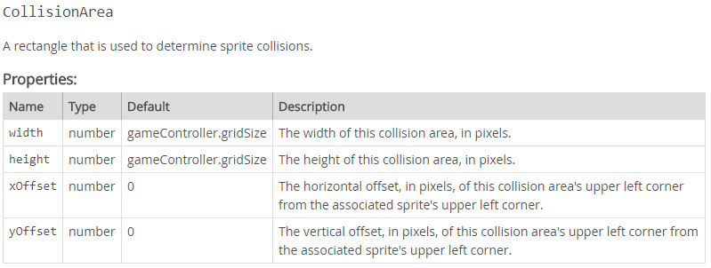

Wizards' Duel, Part 1

In the last tutorial, we used static image files to portray the characters using png files with a single frame in them.  Now we will use *image sheets* to animate the characters in the story.  These are typically png files with 12 frames in them, three each for left, right, front and back facings of the sprite.  

- [ ] In your c9 workspace, double-click to open `marcusSheet.png`


Notice that the frame corresponding to the single image of Marcus we used in the last tutorial is the 8th one from the left.  On either side is Marcus with one or the other foot forward.  Playing these three frames in succession gives the illusion of Marcus walking down the screen. We will use the `defineAnimation` method to tell the game engine which frames to play for each facing.  

Search for (CTRL+F) `defineAnimation` in the gameController help accessed from the README file in your tutorials folder. 


For example, to define an animation for the "down" direction we would add this line of code:

```javascript
marcus.defineAnimation('down', 6, 8);
```

"The zero-based sheet index" means we start counting from 0, not 1.  So the 7th frame from the left is actually frame number 6 because the first frame is frame 0!  This is the convention for indexing arrays in JavaScript and most other programming languages.

And to display this animation for Marcus we would use:

```javascript
marcus.playAnimation('down');
```

In `wizardsDuel.js`, write some JavaScript code to accomplish the following things:

- [ ] set the `backgroundImageFile` property of the `gameController` object to `floor.png`

- [ ] Use the `preloadImageSheets()` method of `gameController` object to preload the image sheet for Marcus like this:

```javascript
gameController.preloadImageSheets('marcusSheet.png')
```

- [ ] create a `marcus` variable, and set its value to an object with the following properties:

```javascript
name: 'Marcus the Wizard',
imageSheetFile: 'marcusSheet.png',
x: gameController.gridSize,
y: gameController.displayHeight - gameController.gridSize,
immovable: true,
```

- [ ] use the `addSprite()` method to add the `marcus` object to the game.

- [ ] use the `startGame()` method to launch the game engine.

You should see Marcus in the lower left hand corner of the floor, standing there quietly.

## Player Character Navigation

### The Up arrow key

Say we want the up arrow key to move Marcus toward the top of the screen. His back should be showing, and walking animation should be displayed.

- [ ] In Marcus's object definition, add a name: value pair for a property we will call `stepSize`.  Set `stepSize` equal to 2, like this:

```javascript
stepSize: 2,
```

This will be used to define how rapidly Marcus moves up or down the screen in response to our input (2 pixels per game loop).  You won't find `stepSize` listed in the properties of `gameController.Sprite` in the sgc documentation.  `stepSize` is a *custom variable* - it is a property of `marcus` we just created on the fly for our own sinister purposes.  In the future, I will just say something like "In object `marcus`, create a custom variable called `stepSize` and set its value to 2."

- [ ] Look for a `gameController` method in the help file that will execute a function when the up arrow key is pressed.  Hint: it is a `Sprite` method you might have seen listed in the previous tutorial.

Did you find `handleUpArrowKey`?  Let's use it to move Marcus up the screen, and display the corresponding frames.  

- [ ] Add this function definition to the object literal for `marcus`:

```javascript
handleUpArrowKey: function() {
    this.playAnimation('up');
    this.y = this.y - this.stepSize;
}
```

This decreases Marcus's y coordinate by 2 every game loop (recall that y decreases as you move *up* the screen).

- [ ] use the `defineAnimation()` method to define an animation for the 'up' direction and add it to your code, outside of the object definitions.  Note:  you have to add this line *after* you add the sprite to the game!  Hint: look at the method call we used for 'down' at the beginning of the tutorial and pick the frames associated with Marcus walking away from us.


- [ ] Run the game. Test that the *up* arrow key causes Marcus to move toward the top of the screen, with his back showing and walking animation playing. 


- [ ] Using the previous steps as a guide, add a function definition to handle a *down* arrow key press, with the appropriate animation and y coordinate change. 


- [ ] Run the game.  Test that the down arrow key causes Marcus to move toward the bottom of the screen, with his front showing and walking animation playing.

Unfortunately, you can walk Marcus completely off of the window.  We should do something about this ... in part 2.

## Wrapping Up

Use Question Set 2 to review and evaluate your mastery of new concepts.

# Wizard's Duel, Part 2

To keep Marcus inside the display area of the window, we need to define a method that executes every game loop pass, and adjusts Marcus's `y` coordinate if it exceeds the display height (minus the sprite width, so it doesn't hang off the edge of the window) or goes negative (which would put the top of the sprite above the top of the window) .  So far we have been using `gameController.Sprite` methods like `handleMouseClick`, `handleDownArrowKey` etc. to define functions to be executed in response to an input from the user.  Perhaps there is another method that will execute every game loop regardless of user input.

- [ ] Check the sgc documentation for an appropriate method in `gameController.Sprite` 

Did you find `handleGameLoop`?  The game engine is built around a "game loop."   This is a repeating series of steps that cycle endlessly as long as the game is running.  When you want something to happen continuously, you can program it in the function definition for the `handleGameLoop` method.  Any commands that you place there will be performed on every pass through the game loop.

There are many ways to confine the `y` coordinate to the display area, but one of the more elegant involves  `Math`methods called `Math.max()` and `Math.min()`.  These, and other methods in JavaScript's `Math` object are explained in detail [here](https://www.w3schools.com/js/js_math.asp).  For example, if we want `y` to stay above zero and below 552 (600 minus the sprite width) we could use the following lines in a `handleGameLoop` function definition:

```javascript
this.y = Math.max(0, this.y);
this.y = Math.min(552, this.y);
```

This is an example of a code segment that should include comments, since it is not immediately obvious what it does. The first line picks the *greatest* of 0, or the current value of `y` and assigns it to `y`.  The second takes the *lowest* of 552, or the current value of `y` and assigns it to `y`.  In other words, if y gets to -1 as a result of being decremented in a call to `handleUpArrowKey`, the first assignment statement will set it to 0. If `y` gets to 553 as a result of being incremented in a call to `handleDownArrowKey`, the second assignment will set it back to 552.  The net effect is to keep Marcus in the display area.  Unfortunately, writing the code in this way does not make it very flexible, should you decide to change the display dimensions or sprite size.

- [ ] Add a call to a`handleGameLoop` method in the `marcus` object that adjusts his y coordinate as shown above, except modify the second line to use the`gameController` properties of `displayHeight` and `gridSize`.  Don't forget to add comments like this to your function definition:

```javascript
// Keep Marcus in the display area 
```

Now let's give Marcus the ability to cast spells (in the form of projectiles).  To do this we will be creating `marcusSpell` objects -- a lot of them -- that all look the same and do the same sorts of things.  

## Classes and Objects

Please read [Marcus and the Cursed Cheese](http://computationaltales.blogspot.com/2011/08/data-validation-marcus-and-cheese.html), parts 1 - 3.

**In objected oriented programming, a class defines the type of an object. In particular, an object's class defines the data and methods for that object. Alternately, the individual objects in a program can be viewed as specific instances of a class.** (from [Part 3 of Marcus and the Cursed Cheese](http://computationaltales.blogspot.com/2011/09/classes-of-cheese-part-3-of-marcus-and.html)).

There is a lengthy explanation of how to use classes in Javascript [here](https://developer.mozilla.org/en-US/docs/Web/JavaScript/Reference/Classes), but I often find it easier to learn something by using it, so let's jump right in by defining a class for the player's spell sprite.

- [ ] Add the following code to your `wizardsDuel.js` file, somewhere outside the object literal for Marcus.  

```javascript
class MarcusSpell {
    constructor(x, y) { // executed when an object of this class is created
        this.name = 'A spell cast by Marcus';
        this.imageSheetFile = 'marcusSpellSheet.png';
        this.x = x;
        this.y = y;
        this.angle = 0;
        this.speed = 200;
        gameController.addSprite(this);
        this.defineAnimation('magic', 0, 7);
        // you can place other properties and methods here that you want every 
     	// object in the class to have or to execute *at the time it is created*
    }
    // you can place methods here that will belong to every object in the class
};
```

The `constructor` method is a special method for creating and initializing an object created with a `class`. There can only be one special method with the name "constructor" in a class.   In this case we are doing inside the constructor the same things that we did in our object literal for Marcus, and in addition we are calling the `gameController.addSprite()` method and the object's `defineAnimation()` method there, like we did *outside* the object literal for Marcus!  This is a great way to package things together that we want defined, or that we want to execute every time an object of that class is created.

To create an object in the `MarcusSpell` class, we use the `new` keyword, like this (for example):

```javascript
let spell = new MarcusSpell(48, 300);
```

Here we are passing the values 48 to the variable x in the constructor function, and 300 to the variable y.

Say we want Marcus to cast a spell every time we press the spacebar.

- [ ] Add a `handleSpacebar` function definition to the object literal for `marcus` that creates a spell object in the `MarcusSpell` *class*, and plays the 'magic' animation.  Instead of passing fixed numbers to the constructor function, use the current location of Marcus, like this:

```javascript 
let spell = new MarcusSpell(this.x, this.y);
```

so that the spell appears at Marcus's location.  Because we are writing this statement inside the `marcus` object, `this` refers to `marcus`.

*Hint: use the handleUpArrowKey function definition as a guide (from the Player Navigation section)* but use 

```javascript
spell.playAnimation('magic', true);
```

instead of `this.playAnimation()` (which would refer to `marcus`, not the spell object).  The second (optional) parameter tells sgc to repeat the animation if *true*, or to play it once if *false*.

- [ ] Preload `marcusSpellSheet.png` by adding it to your `preloadImageSheets` parameter list.
- [ ] Test your game and ensure that hitting the space bar causes a spell sprite (actually many spell sprites!)  to appear at Marcus's location and move to the right across the display.

## A word about style

You might have noticed that we are using **camelCase** for identifier names (objects, variables and functions), and **PascalCase** for classes.  PascalCase is considered a subset of camalCase, actually (it is "upper case" camalCase, so to speak). This follows generally accepted style guidelines for coding, which makes it easier to read and maintain code that someone else has written.  For more about JavaScript style and coding conventions, refer to the [JS Style Guide](https://www.w3schools.com/js/js_conventions.asp).

## Deleting game objects to conserve resources

When the `spell` objects leave the screen, you have no further use for them. But they do not simply cease to exist. The game engine is still tracking their position and keeping track of all their associated data.

This is a waste of system resources, and this kind of issue can lead to poor game performance. It is time to clean up after yourself!

- [ ] Add the following method to the class definition for `MarcusSpell` *outside* of the constructor definition.  

```javascript
handleBoundaryContact() {
    // Delete spell when it leaves display area
    gameController.deleteSprite(this);
}
```

The`handleBoundaryContact()` method will get called every time x or y  of the associated object are outside the bounds of the display area. In this case, your programming will cause the `spell` objects to be deleted from the game when they leave the room.

## Graphical fine tuning

Now you will improve the visuals of Marcus's spell casting.  Marcus will face toward the right edge of the screen when a spell is cast, so he is looking in the direction that it goes, and the spell sprite will be created in front of him, rather than on top of him as it is now.

- [ ] Define an animation called 'right' for the `marcus` object that uses frames 3 through 5 of `marcusSheet.png` Place the `defineAnimation()` outside of the object literals, and *after* you have added the `marcus` sprite to the game.


- [ ] Inside Marcus's `handleSpacebar` function definition, add a line to play marcus's 'right' animation.
- [ ] Modify the x coordinate you pass to the `MarcusSpell` constructor so that the spell starts one `gridSize` to the right of Marcus, instead of right on top of Marcus.
- [ ] Run your game and verify that Marcus turns to the right and fires a spell in front of him when the space bar is pressed.

## Wrapping Up

- [ ] Use Question Set 3 to review and evaluate your mastery of new concepts.

# Wizard's Duel Part 3

## A Non-Player Character (NPC)

Marcus eventually gets tired at shooting his spells into thin air, so we should give him a target that can shoot back.

- [ ] Create a variable named `stranger`, and set its value to an object with the following properties:

```javascript
name: 'The Mysterious Stranger',
imageSheetFile: 'strangerSheet.png',
x: gameController.displayWidth - 2 * gameController.gridSize,
y: gameController.gridSize,
angle: 270,
speed: 150,
immovable: true,
```

- [ ] Preload the image sheet for the `stranger` (`strangerSheet.png`)

- [ ] Add the `stranger` sprite to the game outside the object literals.

- [ ] Define 'up', 'down' and 'left' animations for the `stranger` outside the object literals and after adding the sprite to the game.  


Note: 'up' and 'down' can use the same frames that we used for the `marcus` object (0 through 2 for 'up', and 6 through 8 for 'down'), but can you tell what frames we should use for 'left'?

- [ ] Run your game and verify that the Stranger appears at the upper right hand corner of the screen and drifts down and off the screen with no walking animation.

To add a walking animation for the Stranger, and to keep him from walking off the screen, we will have to define a `handleGameLoop` function for him, similar to what we did for Marcus when we wanted to keep Marcus in the display area.  Unfortunately if we just follow the same recipe with `Math.max()` and `Math.min()` functions, the Stranger will just wander to the bottom of the screen and stay there, making him a sitting duck for Marcus's wizardry.  To make things more challenging, we will have the Stranger change directions *if* he gets to the edge of the display area.  In order to do this we will use one of the most powerful weapons in the programmer's arsenal:  conditional actions.

## Conditional Actions

- [ ] Read [Learning IF-ELSE the Hard Way](http://computationaltales.blogspot.com/2011/05/learning-if-else-hard-way.html)

Here is the syntax and usage for `if`, `else if` and `else` statements in JavaScript:

```javascript
if (condition1) {
    block of code to be executed if condition1 is true
} else if (condition2) {
    block of code to be executed if the condition1 is false and condition2 is true
} else {
    block of code to be executed if the condition1 is false and condition2 is false
}
```

Consider this code fragment in the context of the Stranger's `handleGameLoop` for example:

```javascript
 if (this.y < 0) {
     this.y = 0;
     this.angle = 270;
     this.playAnimation('down');
 } else if (this.y > gameController.displayHeight - gameController.gridSize) {
     this.y = gameController.displayHeight - gameController.gridSize;
     this.angle = 90;
     this.playAnimation('up');
 }
```

`if` the Stranger is going off the top of the screen, then set his y position back to zero, and change his direction to 270 degrees, and play the 'down' animation.

Otherwise (`else`) if the Stranger is going off the bottom of the screen, then set his position back to where the whole sprite image is showing, and change his angle to 90 degrees, and play the 'up' animation.

The `else` is not strictly necessary in this case but it is good practice to separate mutually exclusive `if` statements with `else` statements to avoid checking something you already know will fail.  Also, the keyword `else` alerts you right away to the fact that the two statements are mutually exclusive, which makes it easier to read the code.

## Comparison Operators

Comparison operators are used within conditional statements to determine equality or difference between variables or values.  We used the greater `>` and less than `<` operators in the previous example to see if the Stranger was out of bounds.  We need a few more.

- [ ] Please read [The Incident at the North Gate (or Why = Is Not ==)](http://computationaltales.blogspot.com/2011/06/incident-at-north-gate-or-why-is-not.html)

- [ ] Refer to [this](https://www.w3schools.com/js/js_comparisons.asp) article on operators and pay particular attention to the difference between `=`, ` ==`, and `===`.  We will be using `===` rather than `==` whenever possible.  Also now might be a good time to learn the symbols for the logical operators AND (`&&`), OR (`||`) and NOT(`!`).

## Deleting Properties

The `delete` keyword deletes a property or method from an object.  For example

```javascript
var person = {firstName:"John", lastName:"Doe", age:50, eyeColor:"blue"};
delete person.age;   // removes the age property from person
```

This can be useful if we want to use one version of a method the first time it is called, but a new version in subsequent calls.

## Putting it all together

- [ ] Add the following function definition to the `stranger` object literal:

```javascript
handleGameLoop: function() {
    // When game starts, move down 
    this.playAnimation('down');
    delete this.handleGameLoop;

    // handle subsequent passes
    this.handleGameLoop = function() {
        // Switch directions at top or bottom
        if (this.y < 0) {
            this.y = 0;
            this.angle = 270;
            this.playAnimation('down');
        } else if (this.y > gameController.displayHeight - gameController.gridSize) {
            this.y = gameController.displayHeight - gameController.gridSize;
            this.angle = 90;
            this.playAnimation('up');
        }
    };  
}
```

- [ ] Run the game and verify that the Stranger changes direction and (temporarily) changes his facing and associated animation when he reaches the edge of the display.

Why temporarily?  Because the condition that triggers play animation only happens once each time the Stranger reaches an edge!  We need to add a statement that keeps the animation going at other times.  

- [ ] Add two more `else if` statements to the above function definition: One that will play the 'up' animation if `stranger.angle` is 90 degrees, and one that will play the 'down' animation if `stranger.angle` is 270 degrees.  In this case the `else` is required -- these are statements we want to execute only when the stranger is *not* at either edge.

*HINT:  Use the `===` operator to compare `stranger.angle` to 90 or 270.*

- [ ] Run your game again and verify that the Stranger animates correctly in both directions.

## Wrapping Up

Use Question Set 4 to review and evaluate your mastery of new concepts.

# Wizard's Duel Part 4

## Hitting a Target

Now you will make the Stranger vulnerable to Marcus's spells. When he is hit, an explosion effect will display and the stranger object will be destroyed. And then a congratulations message will be shown.

The images for Marcus's spell objects are mostly transparent, and only the central rectangle has visible contents.  Until now, we have not concerned ourselves with the Sprite property called `collisionArea` because the default collision area is the size of our standard sprite (48 x 48 pixels).



We want to register a hit on the Stranger only when the rectangular box that defines the spell "projectile" collides with the Stranger, not the whole 48x48 square. 


- [ ] Add this property to the `constructor` method in the `MarcusSpell` class definition.

```javascript
this.collisionArea = { width: gameController.gridSize, height: 10, xOffset: 0, yOffset: gameController.gridSize / 2 - 5};
```

In the previous game, we used the default behavior for `gameController.addSpriteCollisionRule()` -- the objects just bounced when they collided.  Now we'd like to define some different behavior for the collision between a `spell` object (of the `MarcusSpell` class) and the Stranger. Namely:  

1. eliminate both sprites
2. create a fireball at the location where the Stranger used to be
3. end the game with a congratulatory message

### The Collision Rule Handler

We will define this behavior in a custom method we will call `defeatStranger()` that accepts two arguments: the `stranger` object and the `spell` object that collided with it.

- [ ] Add a call to the `gameController's` `addSpriteCollisionRule()` method in the constructor for the `MarcusSpell` class like this:

```javascript
gameController.addSpriteCollisionRule([this, stranger], this.defeatStranger);
```

Here is the help file information for this method:


The first argument is a array containing the two objects involved in the collision.  The second is the name of the method which we will define to handle collisions; in this case `defeatStranger`.

When we create a `spell` object which is an instance of this class, the constructor function will execute and `this` will refer to the `spell` object which was just created.  So every `spell` object will have this `defeatStranger` method -- a method we haven't yet defined.  We will now.

### Number 1: Eliminate both sprites

-[ ] Add the following method definition to the  `MarcusSpell` class *outside* of the constructor:

```javascript
defeatStranger(sprite1, sprite2) {
    gameController.deleteSprite(sprite1);
    gameController.deleteSprite(sprite2);
};
```

So far we have defined our collision rule handler and asked it to eliminate the sprites involved in the collision.

###Number 2: Create a fireball at the location where the Stranger used to be
To create a fireball where the Stranger just was, we will need to create a new object when the collision happens.  We want this object to have the following properties:

- a name (like 'A ball of fire')
- x and y coordinates equal to `stranger`'s x and y coordinates when the object is created
- an image sheet file called `fireballSheet.png`

In addition, we would like to define an explosion animation for it using all 16 frames of the image sheet, and we want to play the animation once.

We could make an object literal using `let fireball = { etc }` and then call the `defineAnimation()` and `playAnimation()` methods, but there is a cleaner way; one that uses classes like we did in part 2.  We will first create a `Fireball` class (upper case camelCase) that does everything in its constructor function that I just described , then in the `defeatStranger()` definition we will create an instance of the class, using the stranger's location.

- [ ] Add the following line to the `defeatStranger` function definition.
```javascript
let fireball = new Fireball(stranger.x, stranger.y); 
```

This will give us a warning in the gutter, because we have not yet defined the `Fireball` class.  We will now.

- [ ] Outside of all the object and class definitions, define a new class called `Fireball`  (use the `MarcusSpell` class definition as a guide)

In the constructor definition for `Fireball`  {

- [ ] Assign each object in the class a name, suitable x and y coordinates, and an `imageSheetFile` called `fireballSheet.png` 

- [ ] Add a function call to `gameController.addSprite(this);` to add the fireball to the game.

- [ ] Define an explosion animation using `this.defineAnimation()` that uses all 16 frames (0 to 15).  

      *HINT: look at the way we defined an animation for `MarcusSpell` except this spell sheet has 16 frames instead of 8.*

- [ ] Add a function call to `this.playAnimation()` to play the explosion animation you just defined.

}

- [ ] Don't forget to preload the image sheet!

This takes care of #2 (create a fireball where the Stranger used to be).

###Number 3: End the game with a congratulatory message
We will accomplish this by defining an `handleAnimationEnd` function for the `fireball` object.  As you might have guessed, this function triggers whenever an animation defined for the associated object completes all of its frames.

- [ ] Add the following to the `defeatStranger` function definition:
```javascript
fireball.handleAnimationEnd = function() {
     gameController.endGame('Congratulations!\n\nMarcus has defeated the 						 mysterious\nstranger in the dark cloak!');
};
```

- [ ] Run your game and test that hitting the Stranger with Marcus's spell has the desired effect.

### Making the Code More Robust

You might have noticed that if you spam spell casting while Marcus is being turned into a ball of fire, you can create an error condition with this message: 

*Error: cannot add sprite collision rule that includes The Mysterious Stranger. The game controller does not know about this sprite. Either it was not added, or it has been deleted.*

The problem is at the place where we add the collision rule in the constructor for the `MarcusSpell` class: we are using `stranger` as an argument in this function, but as far as sgc is concerned, we just deleted that sprite in the `defeatStranger` call.  Let's make the code a little more robust by adding a conditional statement on the `handleSpacebar` function for the `marcus` object. 

One way to do this is to redefine the `stranger` object right after we create a fireball where the Stranger used to be, then check this redefined value before we allow the creation of a new `spell` object with the spacebar.  

-[ ] Add this line after the creation of a new fireball in the `MarcusSpell` class `defeatStranger` method:

```javascript
stranger = null;
```

Now all the properties and methods of `stranger` are gone; and a test of its value will return false.  

-[ ] Encapsulate everything you have in the `handleSpacebar` function definition of the `marcus` object inside an `if` statement like this (using your code in place of the comments):

```javascript
handleSpacebar: function() {
        if (stranger) {
            // create an instance of the MarcusSpell class 
            // play the spell animation
            // play the marcus 'right' animation
        }
}
```

##Targeting the Player Character

The Stranger strikes back!

- [ ] Using the `MarcusSpell` class as a guide, create a `StrangerSpell` class which is nearly identical to `MarcusSpell` except it:

* Has a different `name` property (surprise me)
* Uses the `strangerSpellSheet.png` image sheet, 
* Goes in the opposite direction (angle of 180 instead of 0)
* Has a collision rule handler called `defeatMarcus` which does the same thing as `defeatStranger` except the fireball arguments are `(marcus.x, marcus.y)` and the `endGame` message should be: 

```javascript
gameController.endGame('Marcus is defeated by the mysterious\nstranger in the dark cloak!\n\nBetter luck next time.');
```

- [ ] If you just copy/pasted your `MarcusSpell` class definition (that's what I would have done), don't forget to change the arguments of `gameController.addSpriteCollisionRule` to  `[this, marcus], this.defeatMarcus`, and also redefine `marcus` to false (instead of `stranger`).

I probably don't need to remind you anymore to preload the image sheet for `strangerSpellSheet.png` but this might be a good time to mention the following suggestion from the [JavaScript style guide](https://www.w3schools.com/js/js_conventions.asp): 

*"For readability, avoid lines longer than 80 characters.  If a JavaScript statement does not fit on one line, the 	best place to break it, is after an operator or a comma."*

- [ ] By now your `preloadImageSheets` line is much longer than 80 characters, so you might consider writing it on two lines like this:

```javascript
gameController.preloadImageSheets("marcusSheet.png", 'marcusSpellSheet.png', 
    'strangerSheet.png', 'fireballSheet.png', 'strangerSpellSheet.png');
```

You can tell how many characters are in your line by placing the cursor at the end of your line and looking at the grey text in the lower right corner of your development window.  The first set of numbers is line:character#.  (Line 5, character 73 in this example)


This programming defines a spell to be cast by the Stranger, and makes Marcus vulnerable to that spell.  But how will the Stranger cast his spell?  As a non-player character, there is no one pressing a key to control him. You must automate his behavior.  In the Marcus object, we created a `spell` object in the `MarcusSpell` class every time we hit the spacebar.  Let's add similar code to the `handleGameLoop` definition in the `stranger` object.  Remember any code we place here will execute every game loop.

- [ ] Using the `handleSpacebar` function definition in the `marcus` object as a guide, add the appropriate code to the `handleGameLoop` function of the `stranger` object that does the following:

* test  `marcus` to make sure it hasn't been set to `false` before doing the rest. 


* play the 'left' animation for the Stranger
* create a `spell` object in the `StrangerSpell` class at a location one grid size to the *left* of the Stranger.
* play the 'magic' animation for the `spell` object

- [ ] Run your game.  Verify that the Stranger continuously casts spells toward Marcus, and that the visuals appear in the correct places. Correct any problems before moving on.

## Random Behavior

At this point, the Stranger should be continuously casting spells at Marcus. Once every game loop.

Clearly that is too much.  It's better if the Stranger's spell timing is less frequent and unpredictable. Random, even.

And that's the solution. Every time step, you will generate a random number. Depending on the number, you may or may not have the Stranger cast a spell.  Let's try having the Stranger cast a spell with 1% probability.

We have already used `Math.random()` to teleport our characters to random spots in the room in the previous tutorial, so perhaps you remember that this method generates a random number between 0 and 1 (including zero but not 1).  Since all numbers are equally probable, there is a 100% probability that the number will be less than 1, a 10% probability that the number will be less than 0.1, and a 1% probability that the number will be less than 0.01.

- [ ] Modify your conditional expression that tests if `marcus `is `true`  so that `marcus` has to be `true` *and* (&&) `Math.random()` is less than 0.01.  *If* it is, then cast the spell as above.  In other words, enclose the code you wrote in the previous step inside of an `if` statement like this (still inside the `handleGameLoop` function):

```javascript
if (*** write your conditional expression here ***) {
   // Cast spell to the left            
   // play the left animation 
   // create a new spell in the StrangerSpell class
   // play the 'magic' animation
}
```

except with your code in place of, or in addition to the above comments.

- [ ] Run your game and test that the Stranger casts spells at Marcus at a suitably challenging frequency.  If 1% is not suitable, change your conditional expression to taste.

## Limiting Marcus's Spell Casting

Marcus can cast spells as quickly as the player taps (or holds) the spacebar. It is possible for Marcus to cast a solid line of spells that extend across the entire screen. That makes the game too easy to be interesting.  Let's say we want Marcus to cast a spell only once every two seconds.  In order to program this we will have to learn about scheduling events with the game engine's built-in timer.

We can get the number of seconds that have elapsed since the game started with the `gameController.getTime()` function.  As usual, you can check the usage and syntax for this method in the [gameController documentation](https://dewv.github.io/csci110-retooled/sgc/GameController.html).  Here is how we might use it.  

First let's set our timer.

-[ ] Create a `marcus` property called `this.spellCastTime` and set it's value to zero.

Now we define a *local* variable that stores the current time.

- [ ] Add the following inside the `handleSpacebar` function for Marcus above your conditional expression (the one that says `if(stranger)`:

```javascript
 let now = gameController.getTime();  // get time
```

And subtract the two every game loop to see if two seconds has elapsed.

-[ ] Modify the `if (stranger)` conditional expression as follows:

```javascript
// see if stranger exists AND current time is 2s greater than last spell cast
if (stranger && now - this.spellCastTime >= 2) { 
    // if it is, reset the timer and cast the spell 	
    this.spellCastTime = now;		  
   	// Cast a spell to the right
 }
```

- [ ] Move your three lines of spell-casting code to inside the brackets of the `if` statement shown above (where I have the `// Cast a spell to the right` comment).

Hopefully the comments explain how we use the `getTime` function to set and reset a timer, and how to use the difference between the timer and current time to have something happen after 2 seconds has elapsed.  

What might not be so clear is why we use the `let` keyword to hold the current time, and a previously undefined object property `marcus.spellCastTime` to hold the time that the last spell was cast.  If we used `let` for the `spellCastTime` variable too, it would be redefined every time `handleSpacebar` is triggered, which would make it worthless as a holder for the last spell cast time.  This is important to remember:

*Local variables are created when a function starts, and deleted when the function is completed.*

Instead we need a variable that will stick around even when we get ejected from the `handleSpacebar` function because the `if` condition fails (i.e. because the timer hasn't yet "gone off"). Thus, we use an object property which was declared outside of any function and therefore has *global* scope.

## When Spells Collide

The game is bit more interesting when opposing spells destroy each other.

- [ ] Outside all of the object and class definitions, define a custom array called `spellClasses` which contains the values 'MarcusSpell', and 'StrangerSpell'.
- [ ] Outside all of the object and class definitions, define a custom function called `spellCollisionHandler` that accepts two arguments: `spellSprite1` and `spellSprite2` and executes the following code:

```javascript
let fireball = new Fireball(spellSprite1.x, spellSprite1.y);
fireball.handleAnimationEnd = function() {
	gameController.deleteSprite(this);
};
gameController.deleteSprite(spellSprite1);
gameController.deleteSprite(spellSprite2);
```

- [ ] Outside all of the object and class definitions, add a *class* collision rule to handle collisions between any object of the associated classes like this:

```javascript
gameController.addClassCollisionRule(spellClasses, spellCollisionHandler);
```

- [ ] Run your game and test that opposing spells destroy one another as intended.

## Wrapping Up

- [ ] Read [Functions and Sailing](http://computationaltales.blogspot.com/2011/04/functions-and-sailing.html)

This completes the Wizard's Duel tutorial.

- [ ] Upload your `wizardsDuel.js` file to the Assignments tab in Sakai.

- [ ] Use question set 4 to review and evaluate your mastery of new concepts.
# Shooter project
- [ ] Create or download a "shooter" sprite and background.  This can be a spaceship, a person, a dripping faucet, evil cucumber, or whatever.  *You can even re-use the sprite and background from your first project.*
- [ ] Create or download one or more target sprites.  This can be a person, a soccer goal, an asteroid, space alien, computer science teacher, etc.
- [ ] Create or download projectile sprites.  They can be dots, bananas, rockets, etc. or you can re-use the sprites from Wizard's Duel if you wish.
- [ ] Create a shooter game as similar as practical to Wizard's Duel but different in one or more of the following ways:
* move horizontally and shoot vertically

* target and/or shooter move(s) in two dimensions

* collision handler does something besides blowing up such as increasing speed, multiplying, increasing shooting speed, increasing a score, or whatever.

- [ ] Consider uploading your own, or any open-source sprites you find to the "Sprites to Share" folder of the Resources tab in Sakai. 
- [ ] Upload your finished project to the Assignments tab.  **Site your sources for pixel art in the comments, or explicitly state which sprites are your original work.**  I expect you will be making *your own* unique modifications to your `wizardsDuel.js` script to complete this project.

  Grading is based on level of effort in any of the above categories.  For example if you wish to focus on sprite creation instead of programming complexity, please see [this tutorial](http://makegames.tumblr.com/post/42648699708/pixel-art-tutorial) on pixel art.