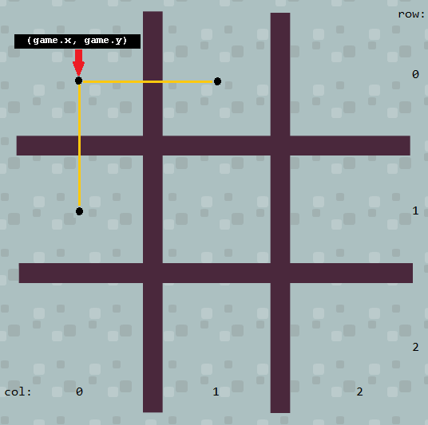

#Puzzled Princess, Part 1

Princess Ann has caught the mysterious stranger at last! Stung by his claim that she is not yet ready to learn about the darkness foretold in prophecy, she rashly agrees to any test the stranger can devise.

## Overview

The game is deceptively simple for humans, but programming the best play for the computer opponent is not an easy task, and will take us several hundred lines of code.  Here is a broad-brush overview of where we are going:

- [ ] Type or paste this into your code window. 

```javascript
import {game, Sprite} from "./sgc/sgc.js";
game.setBackground("floor.png");

class Marker extends Sprite {   }
class PrincessMarker extends Marker {   }
class StrangerMarker extends Marker {   }
class TicTacToe  extends Sprite {   }

let theBoard = new TicTacToe();
theBoard.takeTurns();
```

That's what the whole program will look like, using the collapsed view in the code window (you can use the little white triangles in the left margin to expand or contract the class definitions).  For now this will serve as a useful outline that we can fill in as we go.

* The `TicTacToe` class will keep track of the moves on the board and whose turn it is, and when someone wins loses or draws.  Its methods will be:
   * takeTurns()
   * markSquare(row, col, forOpponent)
   * unmarkSquare(row, col)
   * getSquareSymbol(rol, col)
   * gameIsWon()
   * gameIsDrawn()
   * countWinningMoves(forOpponent)
   * debugBoard() - for printing the current state of the board to the console window
* The `Marker` class places one of the children class marker images on the board with a `playInSquare` method.
* The `PrincessMarker` derived class will handle click-and-dragging the Princess marker onto the board.  This is the player's move.
* The `StrangerMarker` derived class will handle finding the best play for the computer opponent.

Let's start with the board.

## Create the board

- [ ] Define a class called `TicTacToe` , derived from the `Sprite` class whose constructor function accepts no arguments and does the following:

* Gives it a name.
* Uses the `board.png` image file.
* Sets its position to (x,y) = (300, 85).
* Defines a custom variable called `SquareSize` and sets it equal to 150 (the number of pixels on each side of a board square).

* Defines a custom variable called `size` and sets it equal to 3 (for a 3 by 3 board).

* *Declares* but does not initialize a custom variable called `activeMarker` like this:

```javascript
this.activeMarker; // variable exists, but value is undefined
```

In the overview you notice we call a `takeTurns` method to kick everything off.  We'll write enough of that now so that we can start testing the code we have written so far.

##Start the game with the player moving first

Later we will sometimes let the Stranger play first, but for now we want to test our ability to click and drag our Princess marker onto the game board, so we will let her go first.

- [ ] Inside the `TicTacToe` class definition, define a method called `takeTurns()` that accepts no arguments and contains only the following line:

```javascript
this.activeMarker = new PrincessMarker(this);
```

In our program, the `theBoard` object is the only instance we will make of the `TicTacToe` class, so the constructor of the `PrincessMarker` class will always be using `theBoard` as an argument for its constructor.  Let's define the parent `Marker` class before the `PrincessMarker` child class.

##The `Marker` parent class

- [ ] Define a class called `Marker` whose constructor function accepts three arguments(`board`, `image`, and `name`) and does the following:

* Calls the parent class constructor

* Sets the `board`, and `name` properties for each instance of the class equal to the values passed as arguments to the constructor (for example `this.board = board;` and so on)
* Set the image using the string passed to the `image` argument
* Sets its position to (x,y) = (150, 275).

##The `PrincessMarker` child class

This is where you will implement drag and drop so that the player can use the mouse to move the princess game markers.

- [ ] Define a class called `PrincessMarker` that is a *child* of the `Marker` class and whose constructor function accepts an argument called `board` and which does the following:

* Calls the parent class constructor, passing it the values of `board`, `'annFace.png'`, and `'Princess Ann'` for `board`, `image`, and `name` respectively.  HINT: use the `super` keyword like you did in previous tutorials.
* Defines a custom variable called `dragging` and sets its value to `false`.


The `dragging` flag will keep track of whether or not we left-clicked on a Princess marker.

Still in the `PrincessMarker` class definition:

- [ ] Define a `handleMouseLeftButtonDown()` method that sets `dragging` to `true`.
- [ ] Define a `handleMouseLeftButtonUp()` method that sets `dragging` to `false`.
- [ ] Define a `handleGameLoop()` method that tests the value of `dragging`. When it is `true`, the instance is being dragged, so it should move to the mouse pointer's location. You will need to use the `game.getMouseX()` and `getMouseY()` methods, like this, for example:

```javascript
this.x = game.getMouseX() - this.width / 2;
```

We subtract half the width (or height for y) of the sprite so that the *center* of the sprite will land where we release the mouse, instead of the upper left hand corner, where its origin is.

Run your game and verify that:

* The board and princess markers appear over the floor background.
* You can click and hold the left mouse button on a marker to "drag" it, and
* release the left mouse button to "drop" the marker anywhere in the room.

## Controlling the drop

Now we need to add some logic to control where the markers can be dropped.  When a marker is dropped at a spot that is not allowed, it will automatically jump back to its original position.  

For that we will need to know the original position of the marker (i.e. the x and y coordinates in the `Marker` class constructor method).  

- [ ] In the constructor method for `Marker`, create custom variables `startX` and `startY` and set their values equal to the original `x` and `y` coordinates.  You may find the chained assignment version useful again (for example`this.x = this.startX = 150;`)

To know if the spot is allowed, we could find the row and column that the marker is in, and see if it is within the 3x3 board.  For that we will need to know the origin of the `theBoard` (which is an instance of the `TicTacToe` class) as well as its square size and board size.  Later we may also want to verify that the square is unoccupied.

###Passing by reference

How do we access the properties of the `theBoard` board from another class definition?  If `theBoard` object existed before run-time (like with an *object literal*), we could just say `theBoard.x` for example.  Unfortunately this object does not exist until the program starts.  One way around this is to pass the name of the instance to the class!  In essence we are passing an *object* to a method as an argument, instead of passing a *value* to a method as an argument, like we have been doing so far.  This is referred to as "passing by reference" (as opposed to "passing by value").  When we pass by reference, we can modify the object's properties if we want to.  There is a more lengthy comparison of passing by value or passing by reference [here](https://codeburst.io/javascript-passing-by-value-vs-reference-explained-in-plain-english-8d00fd06a47c).

For example we can refer to `x` property of `theBoard` object from the `PrincessMarker` class like this:

```javascript
this.board.x
```

`x` is a property of whatever object `board` refers to, and `board` is a property of the current instance of the `PrincessMarker` class.  A property of a property!  This is hard to grasp so let's take a moment to summarize what we have done so far.

Look back at the overview section for a moment.  Notice on the second-to-last line we are creating an instance of the `TicTacToe` class called `theBoard`.  Like every member of its class, `theBoard` has a method in it called `takeTurns()`, which we call in the last line of the code.  The `takeTurns()` method creates an instance of  the `PrincessMarker` class, and it passes the name of `theBoard` to the `PrincessMarker` constructor method!  Look at your `takeTurns()` method again to confirm this:  

```javascript
this.activeMarker = new PrincessMarker(this);
```

Here `this` refers to an instance of the `TicTacToe` class - meaning `theBoard` in our case.  The constructor method of `PrincessMarker` calls the constructor of the parent `Marker` class, which makes `game` a property of any instance of the `Marker` class with the `this.board = board;` command.  There is a lot of complex programming happening here; you can be proud of your accomplishment if you can follow this line of reasoning.

###Computing the board row and column

Here is how we want to identify the rows and columns on the board:




Remember the length of the yellow line is stored in the `squareSize` property of (an instance of) the `TicTacToe` class. Notice the top row of the board is numbered 0, and the bottom row is numbered 2. 

- [ ] In the `handleMouseLeftButtonUp` method of `PrincessMarker` class, define a local variable called `row`.  Devise an expression (a formula) that calculates the game board row number that the instance was just dropped in and store this value in `row`. The value should be rounded down to the nearest integer (i.e. truncated so that 2.9 become 2 for example).  The `Math.floor()` method might be useful.

I know you can just use 150 for this but challenge yourself to use the property name in your expression.  It will be a good test of your understanding of the "property of a property" thing, and it will make your code easier to maintain if you should choose to change the board size (and therefore the size of the squares) at some later date.

There is no need to limit your expression to values of 0 to 2. In other words, when a marker is dropped above or below the board, the value computed by the expression will not be in the range 0 to 2. This is not a problem; it will become useful later.

- [ ] To test the correctness of your expression, add the following statement to the `handleMouseLeftButtonUp` method, then run the game.  Test all three rows, as well as positions above and below the game board.

```
window.alert("The row number is " + row);
```

Do not proceed until the expression is correct.

- [ ] Declare a local variable named `col` (short for "column"), and use it to store the number of the board column. This is computed with an expression similar to the one that computes the row number.

As before, test by using a console message to show the column number that is computed.

Do not proceed until the expression is correct.

- [ ] Remove all `window.alert` statements used for testing.

###Preventing drops outside the board

We can use these values of `row` and `column` to determine if the marker has been dropped within the board.

- [ ] Within the `handleMouseLeftButtonUp` of the `PrincessMarker` class, write an `if` statement to test if the row and column are outside the playable area using the `game.size` property.  If so, set the marker's `x` and `y` coordinates to their original positions (`startX`, `startY`) and exit the method with a `return` statement. 

The return statement stops the execution of a function and returns a value from that function.  We will be using it a lot in this tutorial so you might want to familiarize yourself with its [syntax and usage](https://developer.mozilla.org/en-US/docs/Web/JavaScript/Reference/Statements/return).

###Centering the marker

The game display will be much cleaner if markers are placed neatly in the center of game board squares. The player, however, may drop them off-center. In fact, the current programming will allow the player to drop markers on the dividing lines of the board. This is messy and confusing. You will now add code to reposition the marker in the center of the square it was dropped in.

- [ ] Inside the class definition for the `Marker` class, define a method called `playInSquare` that accepts `row` and `col` as arguments and changes the values of `this.x` and `this.y` so that the marker is horizontally and vertically centered in the square where it was dropped. You must devise an expression to compute the correct x and coordinates.  Please use the `this.game.x`, `this.game.y` and `this.game.size` properties again instead of their numeric values.
- [ ] At the end of the `handleMouseLeftButtonUp` method of the `PrincessMarker` class, add a call to `this.playInSquare(row, col)`.

We would like to follow this with a call to `theBoard` object's `takeTurns()` method.  Remember that `theBoard` is an instance (which is created at run-time) of the `TicTacToe` class.  How can we refer to an instance that doesn't yet exist?  If you need a reminder about how you might do this, review the [Passing by Reference](###Passing by reference) section.

- [ ] At the end of the `handleMouseLeftButtonUp` method of the `PrincessMarker` class, add a call to the `takeTurns()` method of the game object that is passed to the `PrincessMarker`'s constructor.

Test and correct your game until it shows the desired behavior.

We still need to prevent the player from dropping a marker on top of an existing marker, or moving a marker that has already been placed.  We will do that in part 2.

## Wrapping Up

For more insight into two-dimensional arrays, read [Ushers, Peanut Vendors, and Matrix Indices](http://computationaltales.blogspot.com/2011/07/ushers-peanut-vendors-and-matrix.html).


# Puzzled Princess, Part 2

## Modeling the state of the game

In order to program sophisticated tic-tac-toe play, we will need to model the state of the game with data.

- [ ] Add the following to the constructor method of the `TicTacToe` class definition:

```javascript
this.board = [];
for (let row = 0; row < this.boardSize; row = row + 1) {
      this.board[row] = [];
      for (let col = 0; col < this.boardSize; col = col + 1) {
          this.board[row][col] = this.emptySquareSymbol;
      }
}
```

This creates and initializes an array that will model the contents of the tic-tac-toe board. Unlike the one dimensional arrays you have seen so far, `board` will be a two-dimensional array. You can think of it as a matrix or a data table with rows and columns.  JavaScript does not have a special syntax for creating multidimensional arrays. A common workaround is to create an *array of arrays* in nested loops like we did here.

The `board` array has three rows and three columns, for a total of nine cells. The code sets each of the nine cells to contain the value of`emptySquareSymbol` (which we want to be a dash).

- [ ] Create a custom variable in the constructor of the `TicTacToe` class called `emptySquareSymbol` and set its value to '-'.  This has to be declared before we use it in the nested `for` loops. 

The code uses two loops to access every cell of the array. One loop is "nested" inside of the other.  The outer loop generates three row arrays (indexed from 0 to 2).  The inner loop generates column numbers 0 to 2, for whatever the row array index happens to be. 

In other words, the innermost assignment statement is executed nine times, once for each array cell. The inner loop causes it to repeat three times, and the outer loop causes all that to repeat three times. Three repetitions of the outer loop multiplied by three repetitions of the inner loop makes nine repetitions in total: 3 x 3 = 9. You can always compute the total repetitions of nested loops by multiplying the repetitions of each individual loop.

Study this nested `for` loop pattern carefully. This is the key to processing two-dimensional arrays, and this pattern will recur throughout this game project.

As a test of your understanding, see if you can figure out which is the *fourth* cell of the array to be marked empty.[^*]

Now when the game starts (i.e. when we create an instance of the `TicTacToe` class called `theBoard`), a `board` array will be created, as a model of the empty game board.

### Using `substring` to pick out a marker symbol from the name

We already have a symbol for an empty square (-).  We should also define symbols for the stranger and the princess markers.  We could define these separately in the class definitions for the `PrincessMarker` and `StrangerMarker`, but a more elegant way is to do it in the parent class by using the first character of whatever `name` is passed to the parent class constructor with JavaScript's `substring` method.  You can read more about `substring` [here](https://www.w3schools.com/jsref/jsref_substring.asp).

- [ ] Add this line to the constructor of the `Marker` class definition (after you create the `name` property):

```javascript
this.squareSymbol = this.name.substring(0, 1);
```

The `name` property is a string of characters (or *string* for short).  In our program, the `name` property could refer to the string 'Princess Ann' or the string 'Stranger'.  Remember the first element of an array (or string - which is an array of characters) is numbered 0, so `substring(0, 1)` extracts the characters in the string between 0 and 1, not counting the 1, which is to say, it extracts the first character in the string. Thus, the `squareSymbol` property for any instance of the `PrincessMarker` class will be a 'P' since we passed the parent class the name 'Princess Ann' in our `super` call, and similarly 'S' will be the square symbol for any instance of the `StrangerMarker` class.

## Debugging the board array

The array is only data stored in the computer memory; it is not an instance with a sprite that you can see on the screen. Nothing on the screen gives any indication of its contents either -- unlike x, y coordinates, speed values, etc. This invisibility will be an advantage when programming tic-tac-toe strategy, but it is a bit difficult to get used to.

More importantly, it will be difficult to know with certainty if the array contents correctly model the visual board. We could sure use something to let us "see" that array.

- [ ] In the `TicTacToe` class definition, outside the constructor, define a method named `debugBoard`, containing the following code:

```javascript
debugBoard() {
     let boardString = '\n';
     for (let row = 0; row < this.boardSize; row = row + 1) {
         for (let col = 0; col < this.boardSize; col = col + 1) {
             boardString = boardString + this.board[row][col] + ' ';
         }
     	 boardString = boardString + '\n';
     }
     console.log('The current state of the board is ' + boardString);
 }
```

The purpose of this method is similar to the dialog boxes that you temporarily used in the previous part of the tutorial: to display internal data values so that you can check their correctness. But instead of calling `window.alert()` to display a dialog box, this method calls `console.log()`. This JavaScript method displays its string argument in the console window. The console window is visible whenever you open `Developer Tools` inside a browser window (use `F12` or `Ctrl+Shift+i` on PC or `Cmd+Opt+i` on Mac).  This is where we want it, because debug messages are for the programmer's use only, and not part of the program's "real" output.

The first step of the method adds an empty line (a string containing the *escape sequence*  '\n' for "new line" ). This creates a blank line at the top of the output, which is helpful for readability. Then we have nested loops that visit each cell of the array. Notice the termination tests of these loops: the inner and outer loop call `this.boardSize`. Both of those board property names could have been replaced with the number 3. Although that would be simpler, it would not be nearly as flexible and safe. By using the board properties, the loops are correct, even if the size of the array changes. (For example, you might decide to transform the 3x3 board into a larger game like Connect 4.)

For each row, a string is built. It is set to be an empty carriage return at the top of the outer loop. The inner loop concatenates the contents of each of that row's columns, with two spaces separating them. After the the inner loop completes, another new line escape sequence is added.  After the outer loop completes, the string is displayed.

In the output, empty board squares will display as a dash (minus sign), princess marker squares will display with a capital letter "P", and stranger marker squares will display with a capital letter "S". 

With this debug script in hand, you are ready to take the next step in using the array.

## Updating the board array

You need to update the board array whenever a marker is placed on the board.

Modify the `playInSquare` programming that places a marker on the board in the `Marker` class definition. 

- [ ] First, add an assignment statement that stores `this.squareSymbol` in the array cell that corresponds to the board row and column. Remember how to access the `board` array, which is a property of whichever `TicTacToe` instance gets passed to the `Marker` 's constructor.  HINT: `this.board[row][col]` won't work here because `board` is not (directly) a property of `Marker` class instances.

- [ ] Next, add a call to `TicTacToe`'s  `debugBoard()` method so that you can check the array contents.  Same comment applies.

Run the game, and test by dropping markers in various board positions. Verify that the debug output shows the array matching the game board.

An example of correct debug output is shown in the figure below.

 

The compile window, shown on the right side, contains the output from three calls to the `debugBoard()` method. It shows that the array contents correctly reflect the visual game board.  Do not continue until your debug output correctly matches the visual game board.

### Adding a turn counter

In `TicTacToe` 's `debugBoard` definition:

- [ ] Create a local variable called `moveCount` and set its value to zero.

- [ ] Replace your `console.log` statement with this one:

```javasript
console.log('The board after ' + moveCount + ' move(s):' + boardString);
```

We need some way to increment the `moveCount` variable for every square that isn't empty.  We already have a nested `for` loop that visits every square on the board, so we might as well have it do this other task for us besides growing the `boardString` string:

- [ ] Inside the column loop of the nested `for` loops, test to see if the current square contains the `emptySquareSymbol`.  If it does NOT, increase the value of `moveCount` by one.  Again, challenge yourself to use the property name instead of the character '-' (HINT: it is a property of the `TicTacToe` class instances).

Run the game again, and test by dropping markers in various board positions. Verify that the debug output displays the turn number correctly.  

## Locking markers on the board

At this point, it is possible to move markers that have been placed on the board. This can lead to incorrect array contents, because the array is not updated when a marker is *removed* from a board square. Of course, it is also against the game rules, so it is time to prevent it.

One way to do this, is to create a *flag* that indicates whether or not the marker has been played, and then check that flag before we do any mouse button handling.

In the `Marker` class definition:

- [ ] Inside the `constructor` method, define a variable called `inBoard` and set its value to `false`.
- [ ] In the `playInSquare` method, set the flag to `true` to indicate that the marker has been played to a valid square.

In the `PrinessMarker` class definition:

- [ ] *At the very beginning* of the `handleMouseLeftButtonDown` and `handleMouseLeftButtonUp` definitions, test to see if the flag has been set to true.  If so, exit the method with a `return` statement.   Remember, you don't have to use `if (this.inBoard === true)`.  The Boolean variable `inBoard` returns `true` all by itself!  It is more elegant and efficient to use `if (this.inBoard)` to do the same thing, and to design your flag names to make code like this readable.

Run the game and verify that markers cannot be moved after they are dropped in the game board.

## Controlling the drop, take 2

You may have noticed that there is a problem when you drop one marker on top of another. The program doesn't increment the turn counter but it does call `takeTurns()` again, which will create a problem when we start playing with the stranger.

We will need to add some logic to prevent this and to have the marker automatically jump back to its original position if placed on another marker, just like we did when it was dropped outside the confines of the board in [this](###Preventing drops outside the board) section.  This is a task for our `board` array!

- [ ] In `PrincessMarker` `handleMouseLeftButtonUp()` method definition, add another *OR* condition to the `if` statement that checks to see if the marker was dropped outside the playable area:  the condition is "is there *NOT* an empty square symbol in this square?"  

Run the game and verify that the marker returns to the start position if placed on another marker, without calling `takeTurns()`.

That takes care of the player move and game state-modeling.  Next we will program the NPC's move.


# Puzzled Princess, Part 3

## The stranger moves

Now that the player can drag princess markers onto the board, it is time to program the NPC stranger's moves. For now, the stranger will make the simplest possible legal move: taking the first open square that it finds by randomly searching. Later, the stranger's play will become very sophisticated. 

First let's make a `StrangerMarker` class much like the `PrincessMarker` class:  

- [ ] Define a class called `StrangerMarker` that is a *child* of the `Marker` class and whose constructor function accepts an argument called `game` and which does the following:

- Calls the parent class constructor, passing it the values of `game`, `'strangerFace.png'`, and `'Stranger'` for `game`, `imageFile`, and `name` respectively.

Inside the `StrangerMarker` class definition, outside its constructor:

- [ ] Define a `handleGameLoop()` function that contains the following code

```javascript
if (this.inBoard) {
    return;
}
```

Just like we did to "lock in" princess markers that had already been placed in the board, we use the `inBoard` flag to skip every `StrangerMarker` instance that has already been played.  We can think of this as "do nothing if the marker has already been played." Remember, this is the game loop method for *every instance of the class*, and we really only want to find a move for the marker that hasn't yet been placed.

- [ ] Add the following to the same `handleGameLoop()` method:

```javascript
// Mark a random empty square.
let row, col;
do {
    row = Math.round(Math.random() * (this.game.boardSize - 1));
    col = Math.round(Math.random() * (this.game.boardSize - 1));
} while (this.game.board[row][col] !== this.game.emptySquareSymbol);

this.game.board[row][col] = this.squareSymbol;
this.playInSquare(row, col);
this.game.takeTurns();
```

This introduces a valuable, and somewhat dangerous new looping construct.  The `do` loop is executed as long as the condition after `while` is satisfied.  Therein lies the danger: it is possible to create a loop that will never terminate, possibly locking up your browser window.  In fact, this loop will do just that once all the empty squares are taken.  Please read this short [w3schools](https://www.w3schools.com/jsref/jsref_dowhile.asp) article for an explanation of the do/while statement. 

In this case, we keep trying random column and row numbers between 0 and 2 until we find a square that is empty. Then we mark that board square with the stranger symbol ('S'), place the marker in the right place, and call the `takeTurns` method. 

Next we have to modify our `takeTurns` method so that stranger can make his move.  We will take advantage of the way we declared the `activeMarker` variable in the constructor of the `TicTacToe` class to do something special on turn 1.  Recall that we created the variable, but didn't give it a value.

###Start the game with a random choice of player

In the `takeTurns` method of the `TicTacToe` class:

- [ ] *Remark out* (with `//` ) the line that makes the active marker an instance of the `PrincessMarker` class.
- [ ] Test to see if the `activeMarker` marker does *not* have a value, like this:

```javascript
 if (!this.activeMarker) 
```

Remember the `!` is the NOT operator so if `activeMarker` has a value (which is to say *is defined*), `this.activeMarker` will return true.  So far, the `activeMarker` variable has been declared but has no value so `this.activeMarker` will return false.

- [ ] If it does *not*, flip a coin to make it either an instance of `PrincessMarker` class, or (*else*) the `StrangerMarker` class.  HINT:  `Math.random()` will return a value of less than 0.5 about 1 time out of 2.  

You already know how to make `activeMarker` an instance of the `PrincessMarker` class -- you have it remarked out.  Now you can remove the `//` and paste it into the right place!  

### Taking turns

After the random choice of starting player, the game should create an appropriate marker for each turn.  The princess markers will be dropped onto the board by the player, and the stranger will move to a random open square.

In the `takeTurns` method of the `TicTacToe` class definition:

- [ ] Add the following code after the `if` statement that checks to see if `activeMarker` is undefined:

```javascript
else if (this.activeMarker instanceof PrincessMarker) {
      // princess has moved; now it's stranger's turn
      this.activeMarker = new StrangerMarker(this);
}
else if (this.activeMarker instanceof StrangerMarker) {
      // stranger has moved; now it's princess's turn
      this.activeMarker = new PrincessMarker(this);
}
```

This checks the current `activeMarker` instance to see which type of marker it is (i.e. what class it originates from), and creates a marker of the other kind.

Run the game, and verify that:

* either a princess or a stranger marker is created at first,
* whenever a stranger marker is created, it goes into a random empty board square (if any), and a new princess marker is created,
* whenever a princess marker is created, nothing happens until it is dropped into a board square, and then a new stranger marker is created, and
* the debug output shows that the array is kept in sync with the screen board.

Do not continue until this is working properly.

## It's not over until the program figures out that it's over

At this point, turn-based play between a human player and an NPC is working. However, the programming does not know if one player wins, or if a full board makes the game a draw. Your next task is to address this.

- [ ] Edit the `takeTurns` method in the `TicTacToe` class, adding the following code at the top:

```javascript
if (this.gameIsWon()) {
	let message = '        Game Over.\n        ';
	if (this.activeMarker instanceof PrincessMarker) {
		message = message + 'The Princess wins.';
	} else if (this.activeMarker instanceof StrangerMarker) {
		message = message + 'The Stranger wins.';
	}
	gameController.endGame(message);
	return;
}

if (this.gameIsDrawn()) {
	gameController.endGame('        Game Over.\n        The game ends in a draw.');
	return;
}
```

This completes the end-of-game programming with appropriate `endGame` messages, but the logic that triggers it calls two methods that do not yet exist. Time to write them.

###Is the game won?

- [ ] In the `TicTacToe` class definition, define a method called `gameIsWon()` with the following partial code:

```javascript
// Are there three of the same markers diagonally from upper left?
if (this.board[0][0] === this.board[1][1] &&
	this.board[1][1] === this.board[2][2] &&
	this.board[2][2] !== this.emptySquareSymbol
	) {
	return true;
}
```

This is the complete logic for testing the diagonal that begins in the upper left corner. If the three cells in that diagonal all match the symbol of the current marker, the script returns `true` to indicate that the player using that marker has won the game.

- [ ] Add (very similar) code to test the other diagonal.


- [ ] Write a loop to determine if there are three in a row horizontally. For each row, test if all three cells match the marker. If so, return `true`.


- [ ] Write a loop to determine if there are three in a row vertically. For each column, test if all three cells match the marker. If so, return `true`.

The last line of the method should return `false`, to indicate that there were not three of the marker in a row.

### Is the game drawn?

- [ ] In the `TicTacToe` class definition, define the `gameIsDrawn()` method. Write nested loops to examine each cell of the array. If the square is empty, return `false`. The last line (outside the loops) should return `true`; the game is a draw if all squares are full.

Run the game and verify that you can play against the (really weak) opponent until the game ends. Test as many different kinds of final patterns as possible: horizontal wins, vertical wins, diagonal wins, and draws.

Test and troubleshoot your programming until it is working correctly.

You now have a working game, and can focus on implementing perfect NPC play.

# Puzzled Princess, Part 4

## Improving the stranger's moves

Currently, the stranger's `Create` event selects a move by claiming the first empty board square it finds. You will now replace this with the first step toward perfect play.

Perfect play in Tic-Tac-Toe can be expressed by applying the following rules, in the order listed.

1. If you have a winning move, take it.
2. If your opponent has a winning move, block it.
3. If you can create a fork, do so. (A fork sets up two winning moves simultaneously. An opponent cannot block them both in one turn.)
4. If your opponent can create a fork, prevent it. There are two ways to do this, listed in order of preference.
   1. Create a winning threat that forces your opponent to block you instead of creating the fork. (You must be careful that the square that will block you is not the square that creates the opponent's fork.)
   2. Take the square that would create a fork for your opponent.
5. If the center square is open, take it.
6. If there is an open corner that is diagonally opposite a corner held by your opponent, take it.
7. Take any open corner square.
8. Take any open square.

Time to implement this logic in JavaScript.

- [ ] In `StrangerMarker`'s  `handleGameLoop` method definition, insert the following code after the statement that does nothing if the marker has already been played.

```javascript
let foundMove = this.findWinningMove();

if (!foundMove) {
	foundMove = this.findWinningMove(true);
}

if (!foundMove) {
	foundMove = this.findForkingMove();
}

if (!foundMove) {
	foundMove = this.findForkingMove(true);
}

if (!foundMove) {
	foundMove = this.findCenterMove();
}

if (!foundMove) {
	foundMove = this.findOppositeCornerMove();
}

if (!foundMove) {
	foundMove = this.findAnyCornerMove();
}

if (!foundMove) {
	foundMove = this.findAnySideMove();
}

if (!foundMove) {
	// Mark a random empty square.
}

if (!foundMove) throw new Error('Failed to find a move.');
this.game.takeTurns();
```

The second-to-last  `if` statement remark implies "if you haven't found a move, pick a random square."  You already have this code.

- [ ] Move your "mark a random square" code inside the appropriate  `if` statement.  Add a line at the end of it that sets the `foundMove` flag to `true`.

This is the outline for perfect Tic-Tac-Toe play. The first method called will play a winning move if one exists, and return a Boolean value to indicate if it found one.  That Boolean value is stored in the `foundMove` flag. If the flag is set to `false` (i.e. no move was found), the next method is called, which looks for the opponent's winning move and blocks it.  

This continues until one of the eight methods finds the move it is looking for, calls `playInSquare` to update the game board, and returns `true`. Then, a call to `takeTurns()` hands control to the princess player.  If no move was found, we display an error message with the Javascript `Error` object.  If you like, you can learn more about the `Error` object [here](http://www.javascriptkit.com/javatutors/trycatch2.shtml), and about the throw statement [here](https://developer.mozilla.org/en-US/docs/Web/JavaScript/Reference/Statements/throw) .

- [ ] Create eight new methods in the `StrangerMarker` class, with names that match the calls shown above (`findWinningMove` through `findAnySideMove`). For now, each script contains a single statement: `return false;`.  There are two methods in the stub list that are passed (Boolean) values.  Please use `forOpponent` in the argument list for those methods when you define them.  This will make more sense later.

Run your program to make sure everything still works as before.

A preliminary version of a method that does (nearly) nothing can be a useful way to ease into complex programming. Programmers call these methods "stubs."

When all the stubs are replaced with complete logic, the stranger will play a perfect game.

### A word about encapsulation

So far, if we have wanted to get information about the board array, we just accessed it directly using `game.board[row][col]`.  It was the quickest way to get us up and running with a working game. The problem with this approach is that it ignores one of the fundamental principles of object-oriented programming: [encapsulation](https://en.wikipedia.org/wiki/Encapsulation_(computer_programming)).  Ideally, the `Marker` class, for example, should not have to know anything about the data structures (like `board` array) we use in the `TicTacToe` class.  If we decide to change anything about the `board` array (row/column order, dimension, name, what symbols mean, etc.) it would break any other code that tried to access it.  Far better to use methods, defined within the `TicTacToe` class, that other classes can use to retrieve (get) and modify (set) the values in the array.  There are other benefits too, which will become clear when we write our first move-finding method.  Let's create these "getter" and "setter" methods now. 

Getter:

- [ ] In the `TicTacToe` class, define a new method called `getSquareSymbol` that accepts two arguments: `row` and `column`, and contains the following code:

```javascript
return this.board[row][col];
```

Setter:

- [ ] In the `TicTacToe` class, define a new method called `markSquare` that accepts three arguments:  `row`, `column`, and `forOpponent`, and which contains the following code:

```javascript
let squareSymbol = this.activeMarker.squareSymbol;
if (this.getSquareSymbol(row, col) === this.emptySquareSymbol) {
	this.board[row][col] = squareSymbol;
	return true;
}
return false;
```

Already one of the benefits is clear - we don't have to re-use the code that checks to see if the square is empty first every time we want to mark a square!  Now the function will just return false if the square was already filled, and won't try to change the value in the square.   We will use the third argument a little later.

- [ ] Modify your code in the `PrincessMarker` class to use the getter function instead of `this.game.board[row][col]` .

While we are at it, let's also write a method that *unmarks* the square; we will need this soon.

- [ ] In the `TicTacToe` class, define a new method called `unmarkSquare` that accepts two arguments:  `row`, and `column`, and which contains the following code (and nothing else):

```javascript
this.board[row][col] = this.emptySquareSymbol;
```

There; we'll never have to use `board[row][col]` outside of the `TicTacToe` class ever again. Run your program to make sure everything still works as before.

###Writing the move-finding methods

- [ ] Complete the `findCenterMove` method. It should first find the *number* of the center row and column and store that value in a local variable called `center`.  It should then test the array to see if the center square is empty. Remember to use your new setter method from the `TicTacToe` class -- it returns `false` if the square is not empty, so it is the perfect thing to put in your `if` statement.  In addition, calling the method marks the square in the board array, saving you a separate step!  So, if `markSquare()` is `true`, your method should call `playInSquare(center, center)` and return `true`. If not, the method returns `false`.  Since you "know" that the board is 3x3, you could use the number 1 in place of center, but challenge yourself to find the center row or column of the board, regardless of the value of `game.boardSize`.  *HINT:  `Math.floor()` could come in handy.*


- [ ] Complete the `findAnyCornerMove` method. It should use `TicTacToe`'s setter function again to test corner squares. If one is empty, the method should play there (calling `playInSquare`) and return true. If all corner squares are taken, the script should return false.  Again, use local variables to find the corners, using the value stored in `game.boardSize` instead of assuming row number 2 and column number 2 are the last row and column.


- [ ] Complete the `findAnySideMove` method. (A side square is any square that is neither the center nor a corner.) The method should use the `TicTacToes`'s setter function to test side squares. If one is empty, the script should play there (calling `playInSquare`) and return true. If all side squares are taken, the script should return false.  For an extra challenge, use `for` loops to find the sides, because we might want to make the `boardSize` value bigger than 3 in the future.

At this point, the stranger plays a complete, but not perfect game. That is, the NPC will always find a legal move, and play with a bit of skill. Since the incomplete stubs simply return false (meaning "no move found") it is possible to run the game at this point.

Run the game and test that:

* the first move is given to the stranger or the princess at random,
* the stranger moves to the center any time it is empty on his turn,
* the stranger moves to a corner if there is an empty one and the center is taken,
* the stranger moves to an empty side square as a last resort, and
* the game ends with the appropriate win/lose/draw message.

Troubleshoot and debug the game until it is working correctly.

- [ ] Complete the `findOppositeCornerMove` method. It is similar to `findAnyCornerMove` except that it tries to play an empty corner that is diagonally opposite a marker belonging to the opponent.  One way to do this is to reuse much of your code from `findAnyCornerMove` with an extra condition in each `if` statement (namely, "AND is the opposite corner occupied by a princess marker?").

The stranger should now play the opposite corner when appropriate. Troubleshoot and debug the game until it is working correctly.

Complete the `findWinningMove()` method.  Write nested loops that examine each array cell. When an empty cell is found, the method should assign the stranger's marker to that array cell. An elegant way to do this is to use this `if` statement inside your inner loop:

```javascript
if (this.game.markSquare(row, col)) { // play tentative move
	// this is where you will put your code to see if the tentative move wins the game etc.
}
```

Just to reiterate; the conditional expression calls the `markSquare` function so in addition to returning `true` if there was nothing in the square, it *also* marks the square! 

This is a tentative move, so you should *not* call `playInSquare` at this point. With the tentative move in the array, call `TicTacToe`'s `gameIsWon()` method to see if the move wins the game for the stranger. If so, finalize the move by calling `playInSquare`, and return `true`. If it is not a winning move, undo the tentative move by setting the array cell back to empty (using `TicTacToe`'s `unmarkSquare()` method). Return `false` if no winning move exists.

The stranger should now play a winning move when it exists. Troubleshoot and debug the game until it is working correctly.

The next script we want to write should block *the princess's* winning move.  We already have a script that checks for a winning move for the stranger; instead of writing a separate script that does the same for the princess, let's modify the `findWinningMove` script as follows:

- [ ] Add an argument called `forOpponent` in `findWinningMove`'s argument list if you haven't done so already (as in: redefine `findWinningMove()` to `findWinningMove(forOpponent)`).
- [ ] In the `if` statement that plays a tentative move, change your call to `this.game.markSquare(row, col)` to `this.game.markSquare(row, col, forOpponent)`. 


So we want the `markSquare` method in the `TicTacToe` class to mark the square for the princess if the `forOpponent` flag is set to `true`.

- [ ] In the `TicTacToe` class `markSquare` method definition, just after the `squareSymbol` declaration, add an `if` statement that checks for the value of `forOpponent` and sets the `squareSymbol` value to `this.squareSymbolForHumanPlayer`.

The point of having this (very long) variable name is to take advantage of the flexibility we have built into selecting symbols for the princess and stranger markers with the `substring()` callout in the `Marker` class.  It would be a shame to lose that by simply saying `squareSymbol = 'P';` So we need to define this property of the game object somewhere.  Since it is specific to the princess, let's do it in the `PrincessMarker` class definition:

- [ ] In the `PrincessMarker` class, add the following to the constructor method:

```javascript
this.game.squareSymbolForHumanPlayer = this.squareSymbol;
```

Remember, `this` has no meaning in a derived class like `PrincessMarker` until you call `super` so make sure this line is after the `super` call.

Look back at your `handleGameLoop` code for the `StrangerMarker` and the [rules](##Improving the stranger's moves) for perfect Tic-Tac-Toe play.  See how the first `if` statement calls `findWinningMove(true)`? That's the way we set the `forOpponent` flag!  The second "rule", after looking for the NPC's winning move, is to block a winning move for the opponent.

The stranger should now block the princess when she has a winning move. Troubleshoot and debug the game until it is working correctly.

# Puzzled Princess, Part 5

## Double threat

A fork is a Tic-Tac-Toe move that creates two separate winning threats. In other words, you place a marker to create two intersecting rows, columns, or diagonals that both contain one empty square and two of your markers. Your opponent can respond by blocking one threat, or the other, but has no way to block both. Your victory is guaranteed on your next move.

###Count winning moves

This is not the easiest programming, so you will proceed in small pieces. When a fork is created, you have two different winning moves available to you. So, you will start this programming with a method that counts the number of winning moves on the board.

- [ ] In the `TicTacToe` class, create a method named `countWinningMoves(forOpponent)`, and add the following partial code:

```javascript
countWinningMoves(forOpponent) {
    let squareSymbol = this.activeMarker.squareSymbol;
    if (forOpponent) {
        squareSymbol = this.squareSymbolForHumanPlayer;
    }

    let winningMoves = 0;

    // check rows
    for (let row = 0; row < this.boardSize; row = row + 1) {
        let emptyCount = 0;
        let markerCount = 0;

        for (let col = 0; col < this.boardSize; col = col + 1) {
            // ADD CODE HERE THAT COUNTS EMPTY SQUARES AND MARKER SQUARES IN THE ROW
        }

        if (emptyCount === 1 && markerCount === 2) {
            winningMoves = winningMoves + 1;
        }
    }

    // check columns
    
    // check first diagonal

    // check second diagonal

    return winningMoves;
}
```

The method will receive an argument that indicates which player (marker) to look for -- like you did in the `markSquare` method for example -- and sets the square symbol to `P` if the `forOpponent` flag is `true`.  The local variable `winningMoves` will hold the count of winning moves found, and the method will eventually return this value.

The nested loops are set up to examine each array cell (or board square), but the goal here is to find rows that contain winning moves. Each time a new row is being started, two local variables are set to zero; these are used to count the empty squares and marker squares in the row. You will finish the counting code in the spot indicated by the comment.  

- [ ] Inside the loops, replace the ALL CAPS comment with the code needed to count the number of empty squares in the row, and the number of markers corresponding to the appropriate square symbol.

A winning move is a row that contains one empty square and two squares with the marker determined by the `forOpponent` flag passed as an argument. This conditional statement and `winningMove` counting is provided for you.

You will be using the code that you just wrote as a model for the next step, so it might be a good idea to check with the instructor before you move on.

- [ ] Using the nested loops from the previous code as a model, create similar code that examines columns (not rows) for winning moves.

Think carefully about which variables you set to zero, and where you do this. When the code has executed to this point in the method, the `winningMoves` variable should contain the total number of winning moves to be found in rows and in columns.

Of course, that leaves diagonals.

- [ ] Add the following partial code:

```javascript
// check first diagonal
    let emptyCount = 0;
    let markerCount = 0;

    if (this.getSquareSymbol(0, 0) === this.emptySquareSymbol) {
        emptyCount = emptyCount + 1;
    } else if (this.getSquareSymbol(0, 0) === squareSymbol) {
        markerCount = markerCount + 1;
    }

    if (this.getSquareSymbol(1, 1) === this.emptySquareSymbol) {
        emptyCount = emptyCount + 1;
    } else if (this.getSquareSymbol(1, 1) === squareSymbol) {
        markerCount = markerCount + 1;
    }

    if (this.getSquareSymbol(2, 2) === this.emptySquareSymbol) {
        emptyCount = emptyCount + 1;
    } else if (this.getSquareSymbol(2, 2) === squareSymbol) {
        markerCount = markerCount + 1;
    }

    if (emptyCount === 1 && markerCount === 2) {
        winningMoves = winningMoves + 1;
    }
```

This is complete code to examine the first diagonal (upper left to lower right) and see if it contains a winning move.

There is a lot of repetitive code here. Although there is a clever way to compress this code, it's a little *too* clever to present here. After you finish the game, you could challenge yourself to see if you can write a compressed version of this code.

- [ ] Using your code for the first diagonal as a model, add code to check the second diagonal (upper right to lower left) and see if it contains a winning move.

### Find forking move

Currently, `findForkingMove(forOpponent)` is a stub that just returns `false`.  

Complete the method definition, using the following strategy: 

- [ ] Use nested loops to examine each array cell. If it is an empty square, tentatively place a marker there, then call `countWinningMoves(forOpponent)`.  If there is more than one winning move as a result of the tentative move, play that move with a call to `playInSquare` and return `true`. If not, undo the tentative move (with a call to `unmarkSquare`) and keep looking. If you go through the entire array, there is no fork to be found, so return false.

Run the game and test the NPC's logic for finding forks. Playing as the princess, place markers so that the stranger has an opportunity to fork, and see that he does so. Troubleshoot and debug until this is working correctly.

## Avoiding the double threat

As you can see, there is no way for the player to win when the NPC creates a fork. (This assumes that the player does not already have a winning move. In this programming, that is guaranteed, because the programming would block it rather than look for the fork.)

So what if the player creates a fork? It is too late for the NPC at that point. So, the NPC needs programming to "anticipate" a fork from the princess, and move to prevent it. The obvious way to prevent it is to take the square first, so it is unavailable to the princess.

We already have the code to look for a forking move for the stranger.  Let's make sure it works for the princess when we pass the argument `true` (see [rule #4](## Improving the stranger's moves)). 

- [ ] In the `findForkingMove(forOpponent)` method, make sure you have `forOpponent` in the argument list for `countWinningMoves` and `markSquare`.

 This ensures that when `forOpponent` is `true` the code tentatively marks the square for the *princess* if there was a forking move; we need to unmark this square for the princess and mark it for the stranger instead.

- [ ] In the `findForkingMove` method, before calling `playInSquare`, unmark the square (using `this.game.unmarkSquare(row, col)`, and then mark it again for the stranger with a call to `this.game.markSquare(row, col)`.

Run the game and test. As the princess, try to create a fork. In most cases, the stranger NPC should block before you can.

In most cases? The NPC's play is not yet perfect; one weakness remains. Suppose that a game begins with the princess taking the upper left corner. The stranger responds by taking the center. The player's best move is to take the lower right corner, opposite the other princess marker. (You might want to draw this board position.)

It is now the stranger's move. With the current programming, he will take one of the corners, in order to prevent a fork by the princess. But he will lose. The princess will take the remaining corner, which is also a fork. The stranger should have taken a side square, forcing the princess to block him from winning on his next move.  This is 4.1 in the [rule's section](## Improving the stranger's moves).

- [ ] In the `findForkingMove` method, find the spot where the stranger makes a play to block a fork by the princess.  Insert the following before the code that unmarks the square and remarks it:

```javascript
if (forOpponent) {
	// ... remove the tentative mark ...
	this.game.unmarkSquare(row, col);
	// ... and try to force opponent to block.
	if (this.forceOpponentToBlock()) {
		return true;
	}
}
```

With this addition, the NPC will attempt to divert the princess from creating a fork by putting her on the defensive. If he cannot create a threat that forces her to block, he will fall back to the obvious, direct block of the potential fork.

Notice that this code removes any tentative move from the array *before* the call to `forceOpponentToBlock`. The method depends on the array as an accurate model of the current game board, so we don't want violate that precondition by leaving a tentative move marked in the array.

- [ ] Create the `forceOpponentToBlock()` method (still in the `StrangerMarker` class) with the following partial code:

```javascript
forceOpponentToBlock() {
	for (let row = 0; row < this.game.boardSize; row = row + 1) {
		for (let col = 0; col < this.game.boardSize; col = col + 1) {
			// Mark the square tentatively ...
			if (this.game.markSquare(row, col)) {
			// if it creates threat to win ...
				if ( /* INSERT CODE HERE */ ) {
				// ... figure out how princess would block it
 				   for (let princessRow = 0; princessRow < this.game.boardSize; 							princessRow++){
                  		for (let princessCol = 0; princessCol < this.game.boardSize; 							 princessCol = princessCol + 1) {
							// Mark the square tentatively for opponent ...
							if (this.game.markSquare(princessRow, princessCol, 										true)) {
								// if this is the block, and it creates no fork ...
								if ( /* INSERT CODE HERE */) {
									// ... unmark the princess block and play here.
									this.game.unmarkSquare(princessRow, 													princessCol);
									this.playInSquare(row, col);
									return true;
								}
								// unmark tentative princess square
								this.game.unmarkSquare(princessRow, princessCol);
							}
						}
					}
				}
				// unmark tentative stranger move
				this.game.unmarkSquare(row, col);
			}
  		}
 	}
	// no move found
	return false;
}
```

This code is rather complex, in part because it looks ahead *two* tentative moves. It begins with a familiar pattern of looking for empty array cells, tentatively marking them for the stranger, then testing if that creates a threat for him to win. If so, code nested at deeper levels determines the princess's best move in response. The innermost loops find empty cells and tentatively mark them for the princess, then test if that (1) blocks the stranger's win, and (2) creates no fork for the princess. If those conditions are met, the stranger actually plays *his* tentative move, which will force the princess to block him or lose. As a result, he has prevented her from creating the anticipated fork.

- [ ] Complete the code shown above. There are two comments that mark the locations of conditional tests that you need to write. This should not require a great deal of code. Think carefully, and make good use of the work already performed. HINT: "If this is the block" means "if there are no longer any winning moves for the *stranger* as a result." And "it creates no fork" means "if there are less than two winning moves for the *princess*."

Run the game and test. It should now be impossible to defeat the stranger. Troubleshoot and debug until the programming is correct.

## The End(?)

Congratulations! You have progressed from Stranger Hunt, a simple click game, to perfect NPC play based on complex JavaScript programming, the world's most widely used programming language.

In many ways, the simple story arc running through these games is a "prequel" to Jeremy Kubica's Computational Fairy Tales. The programming skills that you have learned in this course are valuable in their own right. More importantly (?), programming skills are a prerequisite to fully understanding Princess Ann's quest and the nature of the darkness that threatens the kingdom. If you choose to continue your study of computer science, you will soon apply your new programming skills to investigate the computing topics explained in the tales of Ann's quest and her ultimate triumph.

[^*]: Cell 1,0 (2nd row, first column) would be the fourth cell to be marked empty, since the column runs three times before the row is incremented by the outer loop.